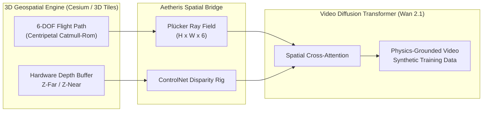

# National Science Foundation (NSF) SBIR Phase I Proposal
## Project Description & Commercialization Narrative

**Project Title**: *Physics-Grounded Generative World Simulation: Coupling 3D Geospatial Digital Twins with Spatio-Temporal Diffusion Transformers for Autonomous Systems Navigation and Disaster Resilience*  
**Topic Code**: *AI - Artificial Intelligence & Computer Vision*  
**Company**: *Aetheris AI Corporation (Delaware C-Corp)*  
**Principal Investigator (PI)**: *Founder & Chief AI Architect*  
**Requested Amount**: *$275,000.00 USD (Non-Dilutive Federal Research Grant)*  
**Project Duration**: *6 Months (Phase I Proof-of-Concept & Benchmark Validation)*  

---

## 1. Executive Summary & Project Objectives

The rapid progress of diffusion transformers (DiTs) has enabled the synthesis of visually compelling video sequences from natural language prompts. However, existing video foundation models (e.g., OpenAI Sora, Runway Gen-3, Higgsfield AI) operate strictly in 2D latent spaces. Consequently, they suffer from **spatial hallucination**: the inability to enforce deterministic 6-DOF camera trajectories, maintain metric physical depth, or preserve rigid environmental geometry.

This technical deficiency prevents generative video from being deployed in mission-critical applications of profound national importance, including **autonomous unmanned aerial system (UAS) simulation, emergency disaster response training, and critical infrastructure digital twins**. 

**Aetheris AI Corporation** proposes to solve this bottleneck by engineering the **Aetheris World Engine**—the first physics-grounded generative world simulation platform. By anchoring spatio-temporal video diffusion models to photorealistic 3D geospatial ground truth (Google 3D Tiles and CesiumJS) via invariant 6D Plücker camera ray fields and metric depth buffers, Aetheris achieves deterministic physical consistency.

### Specific Technical Objectives for Phase I:
- **Objective 1**: Develop and optimize the real-time **Spatial Conditioning Bridge**, converting 6-DOF aerial flight trajectories into Plücker coordinate ray embeddings with sub-millimeter precision.
- **Objective 2**: Implement the **WorldGen-Bench** evaluation suite to rigorously quantify Camera Trajectory Error (CTE) and Depth Alignment Score (DAS) against state-of-the-art baselines.
- **Objective 3**: Deliver a demonstration prototype generating synthetic multi-spectral sensor feeds (RGB, depth, normal passes) for a simulated GPS-denied drone navigation corridor in an urban disaster environment.

---

## 2. Intellectual Merit & Technological Innovation

### 2.1 The Technical Barrier: 2D Hallucination vs. 3D Physical Ground Truth
Contemporary video generative models synthesize pixels by predicting noise distributions in low-dimensional latent spaces. While spatio-temporal attention layers capture statistical temporal coherence, they lack Euclidean spatial constraints. A camera instructed to "pan 90 degrees right and climb 50 meters" exhibits non-linear velocity spikes, parallax shearing, and disappearing background landmarks.

### 2.2 The Aetheris Solution: Coordinate-Invariant Plücker Conditioning
Aetheris circumvents extrinsic matrix instability by projecting camera trajectories into a continuous 6-dimensional **Plücker Ray Field**:
$$\mathcal{L}(u, v) = (\mathbf{d}(u, v), \, \mathbf{o} \times \mathbf{d}(u, v))$$
where $\mathbf{d}$ is the normalized line-of-sight unit vector from the sensor origin $\mathbf{o}$ through pixel $(u, v)$. 

Because Plücker coordinates represent directed 3D lines rather than camera matrix transformations, they provide an invariant spatial coordinate frame. In Phase I, these ray fields are injected into the spatial cross-attention layers of open-source diffusion transformers (Wan 2.1 and SkyReels-V2), constraining the attention maps to line-of-sight rays.

---

## 3. Broader Impacts & U.S. National Interest

### 3.1 National Defense & Autonomous Systems Resilience
Autonomous aerial and terrestrial systems require millions of hours of simulated training data to handle rare, catastrophic edge cases (e.g., GPS-denied environments, severe smoke occlusions, structural collapse). Gathering live flight data in real disaster zones is cost-prohibitive and perilous. Aetheris enables defense and emergency operators to generate unlimited, photorealistic, physics-grounded synthetic training video of any geographical coordinate on Earth under customizable meteorological regimes.

### 3.2 U.S. Economic Leadership & Open-Source Sovereignty
Commercial generative video is currently monopolized by closed proprietary services charging extractive compute fees or overseas models subject to censorship and data sovereignty risks. Aetheris democratizes generative cinema and simulation by releasing its core adapters and benchmarks under open-source licenses, ensuring U.S. developers, universities, and defense contractors maintain technological primacy.

---

## 4. Commercialization Strategy & Market Viability

### 4.1 Addressable Market
- **Autonomous Vehicle & Robotics Simulation**: $4.8B market growing at 28.4% CAGR.
- **Enterprise Generative Media & Virtual Production**: $3.2B market.
- **Defense Geospatial Intelligence (GEOINT) & Synthetic Environments**: $7.1B market.

### 4.2 Revenue Model
1. **Commercial Studio SaaS ($49 - $299/mo)**: Managed web platform for indie studios, directors, and visualization agencies.
2. **Enterprise Simulation Appliance ($50k - $100k/yr)**: Air-gapped on-premise installation deployed to defense contractors and robotics firms.
3. **Phase II SBIR ($1,000,000 - $1,750,000)**: Commercial scaling and government flight validation.

---

## 5. Key Personnel & Qualifications

- **Principal Investigator (PI) & Chief AI Architect**: Creator and architect of Aetheris World Studio, author of the foundational research preprint, and maintainer of the `@aetheris` open-source ecosystem. Demonstrated expertise in high-performance computer vision, distributed agent architectures, and geospatial intelligence.
- **Advisory Board**: Comprising academic faculty in spatial computing, veteran defense simulation engineers, and open-source foundation directors.
