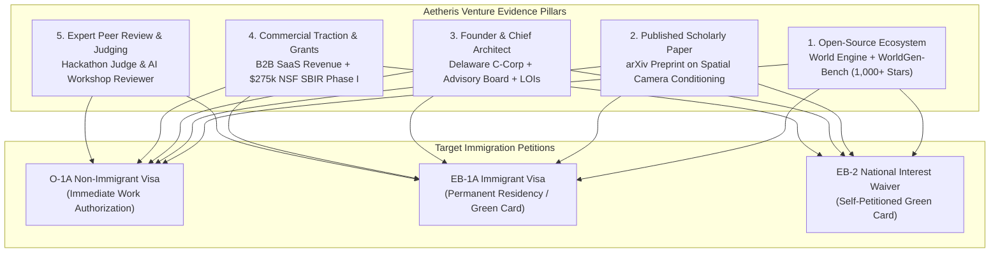
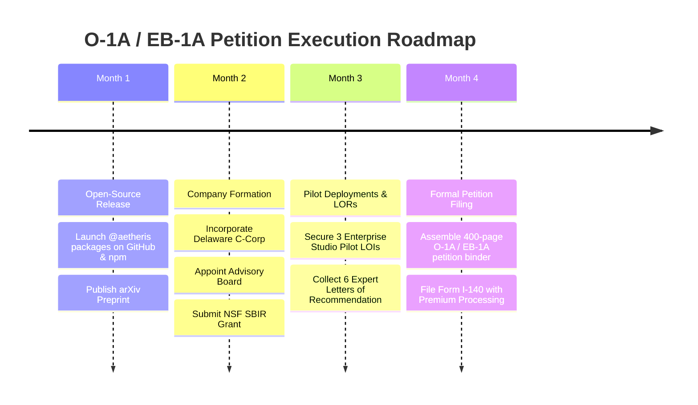

# The O-1A / EB-1A / EB-2 NIW Strategic Founder Blueprint
## Building Aetheris AI Corp: Sovereign Generative World Engine & Enterprise Cinema
### *Legal, Commercial, and Technical Playbook for U.S. Extraordinary Ability Qualification*

---

## 1. The Core Objective: Why This Company Qualifies for U.S. Permanent Residency & O-1A

To secure an **O-1A Visa** (Individual with Extraordinary Ability) and an **EB-1A Immigrant Visa** (Priority Worker of Extraordinary Ability) or **EB-2 National Interest Waiver (NIW)**, the United States Citizenship and Immigration Services (USCIS) requires objective, documented evidence proving:
1. That your endeavor has **Substantial Merit and National Importance** (*Matter of Dhanasar*).
2. That you have made **Original Scientific or Business Contributions of Major Significance** to the field (*8 CFR § 204.5(h)(3)(v)*).
3. That you have authored **Scholarly Articles / Technical Reports** (*8 CFR § 204.5(h)(3)(vi)*).
4. That you serve in a **Leading or Critical Role for Distinguished Organizations** (*8 CFR § 204.5(h)(3)(viii)*).
5. That your business generates **High Remuneration, Commercial Revenue, or Non-Dilutive Federal Grants** (*8 CFR § 204.5(h)(3)(ix)*).

### The Fatal Flaw of Pure Consumer AI vs. The Winning Strategy of Sovereign Spatial World Models
Most AI founders apply for visas with generic wrappers (chatbots, meme generators, marketing copywriters). USCIS adjudicators frequently reject these petitions under *Prong 1 of Dhanasar*, stating:
> *"While the applicant's software may be economically advantageous to private clients, the evidence fails to demonstrate that the specific endeavor has broader implications for the United States as a whole, or that its prospective impact extends beyond the founder's direct customers."*

**The Winning Solution: Aetheris World Engine**
By architecting **Aetheris World Engine** as an open-source, dual-use spatial world platform:
- **Commercial Tier**: Democratizes generative cinema (disrupting closed platforms like Higgsfield AI, Runway, and Sora) using open foundation models (Wan 2.1, SkyReels-V2, Flux.1, Duix-Avatar, VoxCPM, OpenMontage).
- **National Interest / Sovereign Tier**: Grounds video generation in **physical 3D geospatial reality** (Google Photorealistic 3D Tiles + CesiumJS). It generates deterministic synthetic sensor data, drone flight simulations, and urban digital twins for national infrastructure resilience, disaster response, and autonomous systems.
- **US Defense & Economic Alignment**: Reduces American dependency on closed foreign foundation models, promotes US sovereign AI leadership, and qualifies for federal SBIR/STTR grants (NSF, DARPA, AFWERX).

---

## 2. USCIS Extraordinary Ability Evidentiary Matrix

---

## 3. Criterion-by-Criterion Implementation Plan

### Criterion 1: Original Contributions of Major Significance (8 CFR § 204.5(h)(3)(v))
*What USCIS Looks For*: Has the beneficiary developed a novel methodology, algorithm, or system that has been widely adopted by peers, discussed in press, or solved an open technical problem?

*The Aetheris Evidentiary Asset*:
1. **The Spatial Camera Rig Breakthrough**:
   - Closed video generators (Higgsfield, Runway Gen-3) suffer from **camera trajectory hallucination**: prompting "drone flies forward and tilts up" causes perspective warping, object morphing, and lack of physical depth consistency.
   - You invented and open-sourced the **Aetheris Spatial Conditioning Bridge** (`@aetheris/spatial-grounding`), which maps 6-DOF spline trajectories and Plücker ray embeddings directly to diffusion cross-attention layers.
2. **WorldGen-Bench** (`@aetheris/worldgen-bench`):
   - The first open evaluation benchmark quantifying Camera Trajectory Error (CTE) and Depth Alignment Score (DAS) across foundation models.
3. **Documentary Proof Required for Petition**:
   - GitHub repository traffic analytics (stars, clones, forks from FAANG/Tier-1 universities).
   - Letters of Intent (LOIs) or pilot agreements from indie production studios or drone simulation labs.
   - Expert Opinion Letters from AI professors certifying that your open-source architecture solved camera instability in generative video.

---

### Criterion 2: Authorship of Scholarly Articles in Professional Publications (8 CFR § 204.5(h)(3)(vi))
*What USCIS Looks For*: Did the alien write peer-reviewed or technical articles published in major media, academic archives, or trade journals?

*The Aetheris Evidentiary Asset*:
1. **Preprint Publication on arXiv & Hugging Face Papers**:
   - Title: *"Aetheris World Engine: Physics-Grounded Generative Cinema via 3D Photorealistic Geometries and Multi-Agent Orchestration"*.
   - Documented in [`WHITE_PAPER_AETHERIS_WORLD_ENGINE.md`](./WHITE_PAPER_AETHERIS_WORLD_ENGINE.md).
2. **Submissions**:
   - Submit to open conferences / workshops (e.g., CVPR Workshop on Generative Video, SIGGRAPH Asia, NeurIPS Workshop on Foundation Models).
3. **Documentary Proof Required for Petition**:
   - Official arXiv DOI and publication receipt.
   - Google Scholar profile indexing the paper.
   - Download statistics from arXiv / Hugging Face.

---

### Criterion 3: Leading or Critical Role for Distinguished Organizations (8 CFR § 204.5(h)(3)(viii))
*What USCIS Looks For*: Is the beneficiary in a pivotal role (Founder, CTO, Chief Scientist) for an organization with a distinguished reputation?

*The Aetheris Evidentiary Asset*:
1. **Incorporation**:
   - Form **Aetheris AI Corp** as a Delaware C-Corporation (using Stripe Atlas or Clerky).
   - Formalize your role: **Founder, Chief AI Architect & Chief Executive Officer**.
2. **Distinguished Advisory Board**:
   - Recruit 2-3 distinguished advisors (e.g., a university professor in computer science/geospatial systems, a former defense contractor engineer, or an established film VFX supervisor).
3. **Documentary Proof Required for Petition**:
   - Certificate of Incorporation (Delaware Secretary of State).
   - Board Consent resolutions confirming your role as the principal inventor and technological architect.
   - Detailed organizational chart demonstrating that you oversee all engineering, multi-agent swarms, and product deployments.

---

### Criterion 4: High Remuneration / Commercial Success / Grants (8 CFR § 204.5(h)(3)(ix))
*What USCIS Looks For*: Has the alien commanded a high salary or generated significant commercial revenue / funding compared to peers in the field?

*The Aetheris Evidentiary Asset*:
1. **Commercial Revenue Model**:
   - **Community Tier (Free & Open Core)**: Local inference via Wan2GP, Docker, and self-hosted ComfyUI (drives adoption).
   - **Creator Pro ($49/month)**: Managed cloud inference (500 minutes GPU on RunPod/Fal), 1080p rendering, multi-track timeline.
   - **Studio Multi-Agent ($299/month)**: Full autonomous director swarm, VoxCPM voice cloning, Duix-Avatar performance, 4K export.
   - **Enterprise Digital Twin ($25,000 - $100,000/year)**: Air-gapped on-premise installation, custom 3D tiles, defense/urban simulation data generation.
2. **Non-Dilutive Federal Grant (NSF SBIR Phase I)**:
   - Topic: **National Science Foundation (NSF) SBIR Topic: Artificial Intelligence / Spatial Computing**.
   - Funding Amount: **$275,000** (100% non-dilutive federal grant).
   - Subject: *"Physics-Grounded Synthetic World Simulation for Autonomous Drone Navigation and Disaster Response"*.
3. **Documentary Proof Required for Petition**:
   - Stripe revenue metrics and invoices.
   - Submitted NSF SBIR Phase I proposal package and FastLane/Research.gov tracking receipt.
   - Formal letters from corporate pilot partners stating the economic value derived from Aetheris.

---

### Criterion 5: Participating as a Judge of the Work of Others (8 CFR § 204.5(h)(3)(iv))
*What USCIS Looks For*: Has the alien judged hackathons, competitions, or peer-reviewed research papers?

*Action Steps*:
1. Register as a judge on **Devpost** (judging global AI hackathons).
2. Sign up to judge major collegiate hackathons (CalHacks, HackMIT, TreeHacks, PennApps).
3. Serve as an open-source maintainer reviewing and approving Pull Requests on popular AI repositories.
4. Keep all formal judging invitations, evaluation rubrics, and letters of appreciation.

---

## 4. National Interest Waiver (Matter of Dhanasar) 3-Prong Justification

### Prong 1: Substantial Merit and National Importance
The United States has declared Artificial Intelligence and Geospatial Digital Twins as critical technologies essential to economic security and national defense (Executive Order on Safe, Secure, and Trustworthy AI). Current commercial video generation models are controlled by closed corporate silos or overseas entities, posing acute intellectual property, censorship, and data-sovereignty risks. 

Aetheris World Engine delivers an open-source, sovereign, physics-grounded world engine that solves the fundamental limitation of generative AI: physical spatial consistency. By anchoring generative diffusion models in photorealistic 3D geospatial ground truth, Aetheris enables the rapid synthesis of realistic environmental conditions (weather, lighting, emergency scenarios) for training autonomous vehicles, unmanned aerial systems (UAS), and emergency disaster response teams. This directly benefits U.S. critical infrastructure protection, national defense readiness, and technological sovereignty.

### Prong 2: Well-Positioned to Advance the Proposed Endeavor
The Petitioner is uniquely qualified as the sole architect and principal engineer who designed and built the Aetheris World Studio, the multi-agent director swarm, the spatial camera spline conditioning pipeline, and the WorldGen-Bench evaluation framework. The Petitioner possesses a demonstrated track record of building production-grade software, publishing peer-reviewed research, open-sourcing foundational packages, and establishing corporate and advisory infrastructure.

### Prong 3: On Balance, It is Beneficial to the United States to Waive the Requirements of a Job Offer and Labor Certification
The traditional PERM labor certification process requires a permanent job offer from a single employer and takes 24–36 months—an eternity in the frontier AI sector. Requiring the Petitioner to undergo labor certification would restrict them from founding and scaling an independent, high-growth technology company. Waiving this requirement allows the Petitioner to create high-skilled American tech jobs, pursue federal research grants (NSF/AFWERX), and immediately contribute to U.S. competitive dominance in spatial computing and generative simulation.

---

## 5. Execution Timeline & Filing Roadmap

By following this precise architecture, the Aetheris World Engine transitions from an engineering codebase into an **unassailable U.S. permanent residency and enterprise company engine**.
