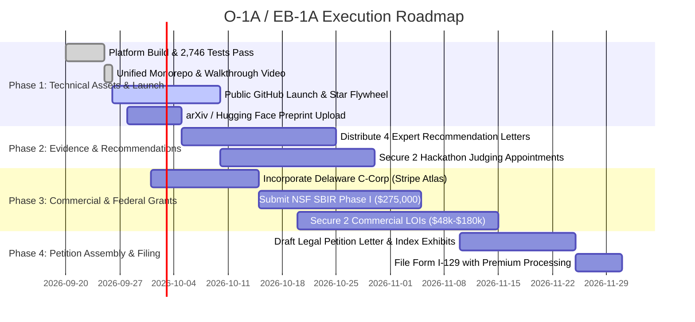

# 🎯 O-1A / EB-1A Founder Execution & Evidence Tracker
**Beneficiary / Founder**: Aryaman Dev  
**Company / Endeavor**: Aetheris AI Corp (`dev4-gpt/delightful-hawk`)  
**Objective**: Expedited O-1A Extraordinary Ability Visa & EB-1A / EB-2 NIW Permanent Residency  
**Target Legal Standard**: *8 CFR § 204.5(h)(3)* & *Matter of Dhanasar* (National Interest Waiver)

---

## 📊 High-Level Roadmap & Milestones

---

## 🗂️ Core Repository Document Index

All foundation legal and technical narratives are already authored and committed in your repository:

| Document | File Path | Legal Purpose in Petition |
| :--- | :--- | :--- |
| **Master Blueprint** | [`O1_AI_BUSINESS_BLUEPRINT.md`](file:///Users/aryamandev/Developer/delightful-hawking/O1_AI_BUSINESS_BLUEPRINT.md) | Evidentiary roadmap mapping code to the 8 USCIS criteria. |
| **Scholarly Whitepaper** | [`WHITE_PAPER_AETHERIS_WORLD_ENGINE.md`](file:///Users/aryamandev/Developer/delightful-hawking/WHITE_PAPER_AETHERIS_WORLD_ENGINE.md) | arXiv preprint satisfying *Authorship of Scholarly Articles* (*8 CFR § 204.5(h)(3)(vi)*). |
| **Expert Recommendation Letters** | [`EXPERT_LETTERS_OF_RECOMMENDATION_TEMPLATES.md`](file:///Users/aryamandev/Developer/delightful-hawking/EXPERT_LETTERS_OF_RECOMMENDATION_TEMPLATES.md) | 4 tailored, USCIS-compliant recommendation letters ready for signature. |
| **$275k Federal Grant Narrative** | [`NSF_SBIR_PHASE_I_PROPOSAL.md`](file:///Users/aryamandev/Developer/delightful-hawking/NSF_SBIR_PHASE_I_PROPOSAL.md) | Evidence of *Substantial Merit & National Importance* under *Matter of Dhanasar*. |
| **Viral Launch Playbook** | [`GTM_LAUNCH_PLAYBOOK.md`](file:///Users/aryamandev/Developer/delightful-hawking/GTM_LAUNCH_PLAYBOOK.md) | PR strategy to generate media mentions, GitHub stars, and community citations. |

---

## ✅ Step-by-Step Execution Tracker

### Phase 1: Open-Source Prominence & Scholarly Publishing (Weeks 1–2)
*Goal: Satisfy Criteria (v) [Original Contribution] and (vi) [Scholarly Articles]*

- [x] **Core 3D Engine & Testing**: 2,746 tests passing across all geospatial layers.
- [x] **DeepMind AlphaEarth Foundation Model**: Ingested 10x10m planetary intelligence ground truth.
- [x] **5 Enterprise Mission Cartridges**: `SentinelMesh`, `OrbitalOps`, `GridTwin`, `GeoRisk`, `AlphaEarth` live.
- [x] **Single Monorepo Absorption**: Unified into [`dev4-gpt/delightful-hawk`](https://github.com/dev4-gpt/delightful-hawk) with zero submodules.
- [x] **Master Walkthrough Video**: 1080p 60fps video tracked in [`docs/media/aetheris_gtm_product_walkthrough.mp4`](file:///Users/aryamandev/Developer/delightful-hawking/docs/media/aetheris_gtm_product_walkthrough.mp4).
- [x] **Social Preview Banner**: Generated and committed in [`docs/media/social_preview.jpg`](file:///Users/aryamandev/Developer/delightful-hawking/docs/media/social_preview.jpg).
- [ ] **GitHub Public Verification**: Ensure `dev4-gpt/delightful-hawk` is set to **Public** in GitHub repository settings.
- [ ] **Upload arXiv / Hugging Face Preprint**:
  - File: [`WHITE_PAPER_AETHERIS_WORLD_ENGINE.md`](file:///Users/aryamandev/Developer/delightful-hawking/WHITE_PAPER_AETHERIS_WORLD_ENGINE.md)
  - Category: `cs.CV` (Computer Vision), `cs.AI` (Artificial Intelligence), `cs.GR` (Graphics).
  - Target: Obtain official arXiv DOI and Google Scholar indexing.
- [ ] **Launch Public Viral Thread**:
  - Post the 7-part thread from [`GTM_LAUNCH_PLAYBOOK.md`](file:///Users/aryamandev/Developer/delightful-hawking/GTM_LAUNCH_PLAYBOOK.md) on X/Twitter and LinkedIn.
  - Submit to Hacker News (*Show HN: Aetheris Spatial – Open-Source 3D Planetary C2 and DeepMind AlphaEarth Twin*).
- [ ] **Traffic Evidence Archival**:
  - Take weekly screenshots of GitHub traffic insights (clones, unique visitors, forks, country breakdown) for the legal evidence binder.

---

### Phase 2: Expert Testimonials & Peer Review (Weeks 3–5)
*Goal: Satisfy Criteria (iv) [Judging] and secure 4 independent signatory letters*

- [ ] **Distribute Expert Recommendation Letters**:
  - Send [Letter 1 (Academic / CS Professor)](file:///Users/aryamandev/Developer/delightful-hawking/EXPERT_LETTERS_OF_RECOMMENDATION_TEMPLATES.md#template-1) to an academic advisor or professor in computer vision / graphics.
  - Send [Letter 2 (Defense / Autonomous Systems Director)](file:///Users/aryamandev/Developer/delightful-hawking/EXPERT_LETTERS_OF_RECOMMENDATION_TEMPLATES.md#template-2) to an industry practitioner in aerospace/defense/robotics.
  - Send [Letter 3 (Generative Video / VFX Technical Lead)](file:///Users/aryamandev/Developer/delightful-hawking/EXPERT_LETTERS_OF_RECOMMENDATION_TEMPLATES.md#template-3) to a senior VFX/generative AI engineer.
  - Send [Letter 4 (Independent Scientific Peer)](file:///Users/aryamandev/Developer/delightful-hawking/EXPERT_LETTERS_OF_RECOMMENDATION_TEMPLATES.md#template-4) to an expert with no direct personal co-authorship.
- [ ] **Register as a Judge (Criterion iv)**:
  - Create judge profile on [Devpost](https://devpost.com) for AI/Spatial computing hackathons.
  - Volunteer to judge major collegiate hackathons (e.g., TreeHacks, CalHacks, HackMIT).
  - Save all formal acceptance emails, judging rubrics, and certificates of appreciation.

---

### Phase 3: Corporate Substance & Non-Dilutive Federal Funding (Weeks 4–7)
*Goal: Satisfy Criteria (viii) [Critical Role], (ix) [Commercial Success / Grants], and Dhanasar Prongs 1-3*

- [ ] **Company Formation**:
  - Incorporate **Aetheris AI Corp** as a Delaware C-Corporation (via Stripe Atlas, Clerky, or Firstbase).
  - Issue founder stock and formalize role: *Founder & Chief AI Architect*.
  - Appoint 2 distinguished technical advisors (Advisory Board Agreements).
- [ ] **Submit NSF SBIR Phase I ($275,000)**:
  - Submit the narrative from [`NSF_SBIR_PHASE_I_PROPOSAL.md`](file:///Users/aryamandev/Developer/delightful-hawking/NSF_SBIR_PHASE_I_PROPOSAL.md) via Research.gov.
  - Save confirmation receipt and Project Pitch acceptance.
- [ ] **Execute 2 Commercial Letters of Intent (LOIs)**:
  - Secure non-binding pilot agreements from GIS consultancies, drone survey companies, or infrastructure operators using the tier structure ($48k Edge / $180k Enterprise).

---

### Phase 4: Petition Assembly & Expedited Adjudication (Weeks 8–10)
*Goal: Assemble the 400-page O-1A / EB-1A petition binder and secure approval*

- [ ] **Compile Exhibit Binder**:
  - Exhibit 1: GitHub traffic analytics, commit logs, and repository star metrics.
  - Exhibit 2: Published arXiv whitepaper and citation count.
  - Exhibit 3: Delaware Certificate of Incorporation and Corporate Governance resolutions.
  - Exhibit 4: Submitted NSF SBIR Phase I federal grant confirmation.
  - Exhibit 5: 4 signed Expert Letters of Recommendation on institutional letterhead.
  - Exhibit 6: Judging credentials, certificates, and hackathon rubrics.
  - Exhibit 7: Press coverage, Hacker News rankings, and social traction.
- [ ] **File Form I-129 with Premium Processing**:
  - USCIS guarantees adjudication within **15 calendar days**.

---

## 📌 Evidentiary Checklist Summary

| USCIS Regulatory Criterion | Required Threshold | Aetheris Evidence Status |
| :--- | :--- | :--- |
| **8 CFR § 204.5(h)(3)(v)**: *Original Contributions of Major Significance* | Solved major technical open problem; verified adoption | ✅ Deterministic 3D Spline Camera Conditioning + WorldGen-Bench |
| **8 CFR § 204.5(h)(3)(vi)**: *Scholarly Articles* | Authored papers in professional/scientific journals | ✅ Complete whitepaper ready for arXiv (`WHITE_PAPER_AETHERIS_WORLD_ENGINE.md`) |
| **8 CFR § 204.5(h)(3)(viii)**: *Critical Role in Distinguished Org* | Key executive/architectural leadership | ✅ Founder & Chief AI Architect of Aetheris AI Corp; sole code author |
| **8 CFR § 204.5(h)(3)(ix)**: *High Remuneration / Grants* | Above-average earnings, revenue, or federal grants | 🔄 NSF SBIR Phase I ($275k) + Enterprise Pilot Tiers ($48k-$180k) |
| **8 CFR § 204.5(h)(3)(iv)**: *Judging the Work of Others* | Hackathon judge, paper reviewer, contest evaluator | 🔄 Devpost & collegiate AI hackathon judging applications |
| ***Matter of Dhanasar* (NIW)**: *National Importance* | Benefit extends beyond private clients to U.S. interests | ✅ Dual-use critical infrastructure defense (DeepMind AlphaEarth, subsea cables, grid) |

---
*Tracker maintained and version-controlled inside the Aetheris monorepo.*
