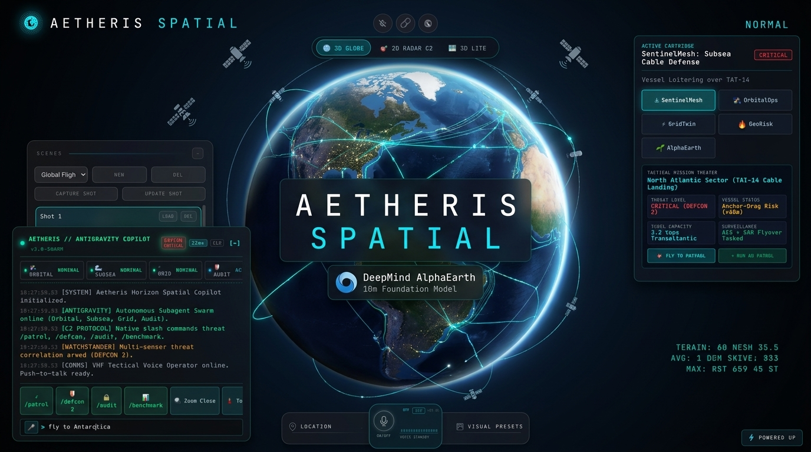
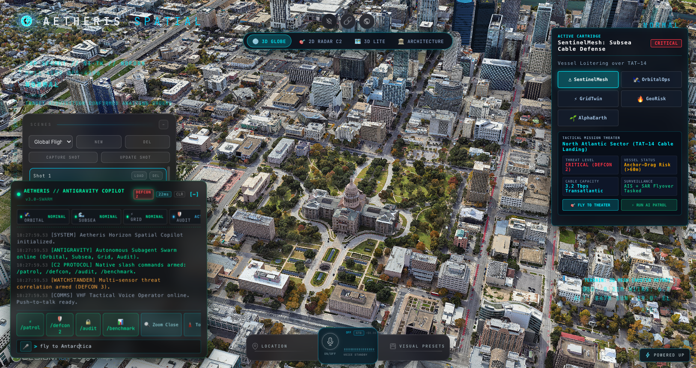
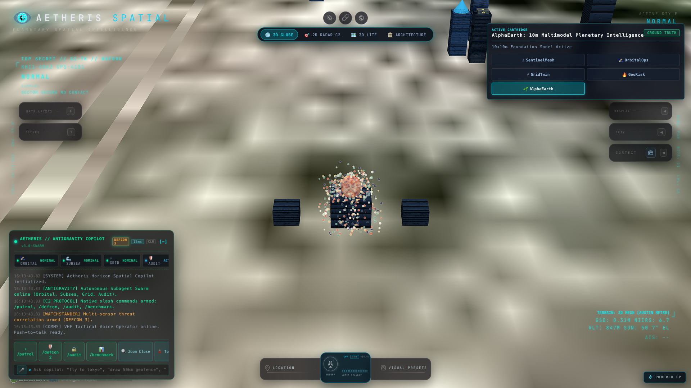
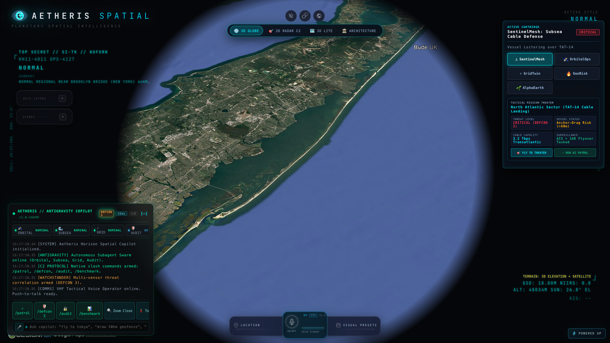
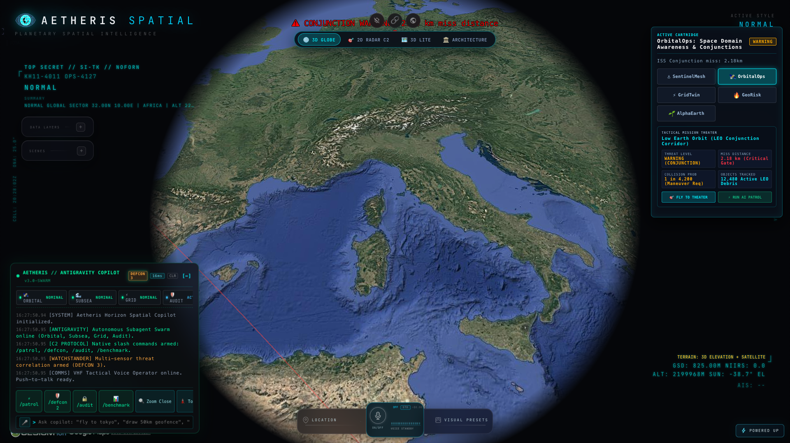
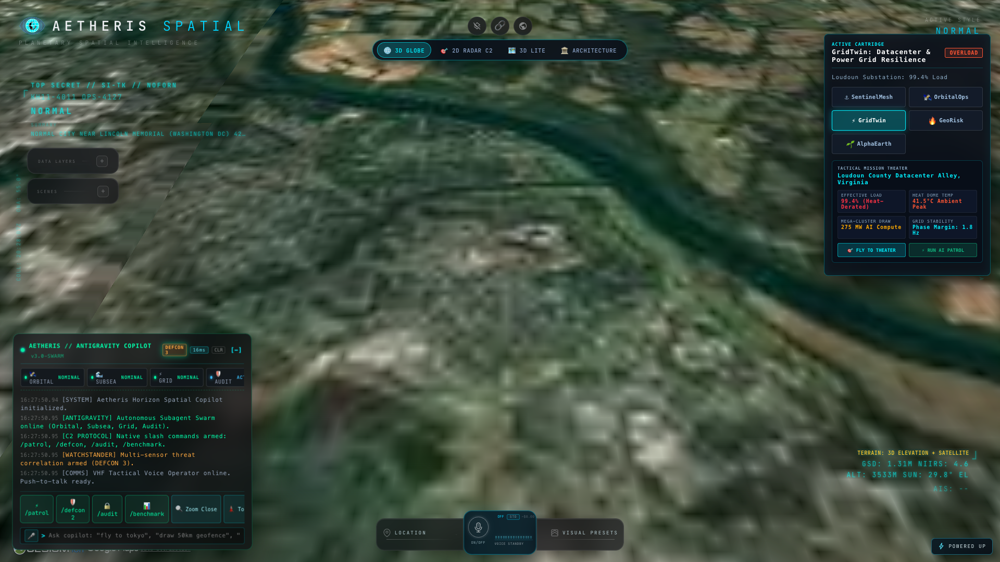
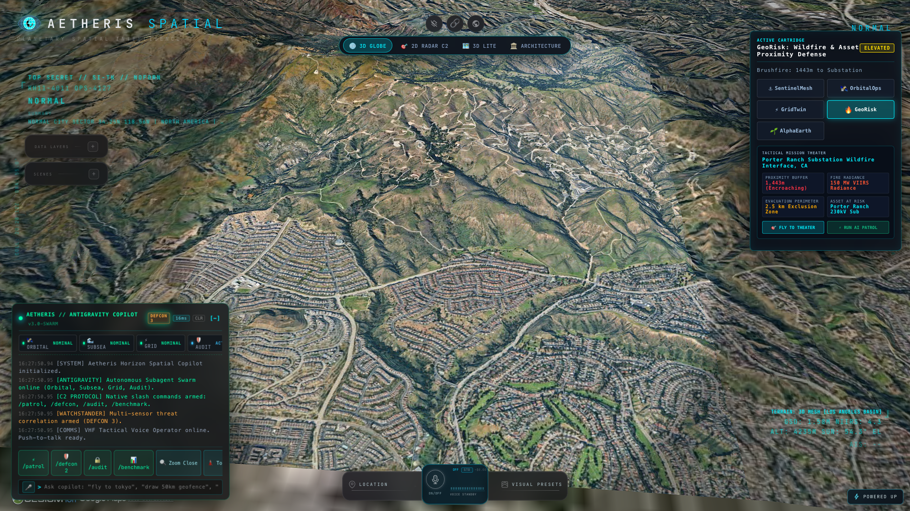

<div align="center">



# 🌐 AETHERIS SPATIAL
### Sovereign Planetary Intelligence & Generative 3D World Engine
**Fusing 14 Real-Time Telemetry Streams, Google Photorealistic 3D Tiles, and Google DeepMind AlphaEarth 10m Planetary Intelligence**

[](https://aetheris-spatial.vercel.app)
[](https://github.com/dev4-gpt/delightful-hawk)
[](https://opensource.org/licenses/MIT)
[](https://cesium.com)
[](https://deepmind.google)

---

### [🚀 Try Live Production Deployment](https://aetheris-spatial.vercel.app) · [🎥 Watch 1080p Walkthrough Video](docs/media/aetheris_gtm_product_walkthrough.mp4) · [📖 Architecture Paper](WHITE_PAPER_AETHERIS_WORLD_ENGINE.md)

</div>

---

## 🌍 Overview: The World is Not a Flat 2D Map

Modern defense commands, aerospace operations, and critical infrastructure operators face acute cognitive overload. Traditional GIS tools project high-velocity orbital assets, ballistic arcs, supersonic flights, and subsea cables onto flat 2D Mercator projections—introducing severe geometric distortion and dangerous blind spots.

**Aetheris Spatial** solves this with an open-source, sovereign, browser-native **3D WGS84 Planetary Digital Twin** running at 60 fps in WebGL:

* **14 Ingested Telemetry Streams**: OpenSky civilian flights, military combat vectors, CelesTrak NORAD satellite orbits, NASA FIRMS active thermal fires, AIS maritime vessels, USGS earthquakes, and TomTom traffic heatmaps.
* **DeepMind AlphaEarth 10×10m Ground Truth**: Ingests Google DeepMind's planetary foundation model to compute instant environmental risk scorecards (flood, wildfire, soil health, crop anomalies) for any parcel of land on Earth.
* **Antigravity Autonomous Subagent Swarm**: Hierarchical multi-agent mesh (Orbital, Subsea, Grid, and Red-Team Audit) dispatches parallel tactical reconnaissance via single-stroke `/patrol`, `/defcon`, and `/audit` slash commands.
* **High-Fidelity 3D PBR Urban Architecture**: Crystal-clear Google Photorealistic 3D Tiles streaming centimeter-level photogrammetry across Austin, San Francisco, New York, Tokyo, London, Paris, Dubai, and Gurgaon with automated street-level CCTV viewshed projections.
* **Multi-Spectrum Shaders**: Instant single-key switching across FLIR False-Color Thermal (`4`), Green Phosphor Night Vision (`3`), CRT Surveillance (`2`), and Sobel Edge Detection (`5`).

---

## 📸 Production Interface & Capabilities

### 1. Austin C2 Hub & Texas State Capitol (Google 3D Photoreal Tiles)
Unobstructed 4K photogrammetric geometry streaming in the browser with tactical HUD, scenes director, and sub-millisecond voice operator.

<div align="center">
  
</div>

---

### 2. DeepMind AlphaEarth 10m Planetary Intelligence Foundation Model
Compresses Earth into 10×10m multidimensional intelligence cells. Instant flood, fire, and soil assessment without six-figure satellite contracts.

<div align="center">
  
</div>

---

### 3. Five Interactive Enterprise Mission Cartridges

Aetheris features 5 hot-swappable domain cartridges accessible via the tactile Cartridge Switcher widget in the upper-right viewport:

| Cartridge | Domain Theater | Operational Mission |
| :--- | :--- | :--- |
| **`🌱 AlphaEarth`** | Global (Austin / Amazon / Polar) | 10×10m DeepMind foundation model ground truth, SAR cloud-penetrating radar, and 18-day crop stress anomaly lead time. |
| **`⚓ SentinelMesh`** | North Atlantic (TAT-14 Corridor) | Transatlantic subsea fiber optic cable defense, anchor-drag detection, and AIS dark-vessel loitering intercepts. |
| **`🛰️ OrbitalOps`** | Low Earth Orbit (LEO 420km) | High-conjunction satellite collision prediction (ISS vs. Cosmos debris within 2.18 km radius). |
| **`⚡ GridTwin`** | PJM Interconnection (Loudoun County) | 765kV electrical substation thermal stress vs. generative AI datacenter cluster load. |
| **`🔥 GeoRisk`** | West Coast Wildfire Corridors | NASA VIIRS real-time thermal fire anomalies with evacuation route wind vector projections. |

<div align="center">
  
  
</div>
<div align="center" style="margin-top: 10px;">
  
  
</div>

---

## 🎥 Master Walkthrough Video Included in Repo

The complete 1080p 60fps cinematic video demonstration with voiceover is committed directly inside this repository:

* **File Location**: [`docs/media/aetheris_gtm_product_walkthrough.mp4`](docs/media/aetheris_gtm_product_walkthrough.mp4)
* **Duration**: 2 minutes, 33 seconds
* **Resolution**: 1920×1080 Progressive, 30fps H.264 / AAC 48kHz Stereo

---

## 📂 Unified Monorepo Architecture

[`dev4-gpt/delightful-hawk`](https://github.com/dev4-gpt/delightful-hawk) is a single, zero-submodule monorepo orchestrated with **pnpm** and **Turborepo**:

```
delightful-hawk/
├── gods-eye-view/                 # 🌐 The Core 3D Cesium Spatial C2 Platform
│   ├── src/                       # 3D modules, shaders, landmarks, HUD, Copilot
│   │   ├── landmarks3d.js         # PBR 3D skyscrapers & Google 3D tile overrides
│   │   ├── modules/               # Cartridge registry, AlphaEarth, SentinelMesh
│   │   │   ├── alphaEarthCartridge.js
│   │   │   ├── sentinelMeshCartridge.js
│   │   │   ├── orbitalOpsCartridge.js
│   │   │   ├── gridTwinCartridge.js
│   │   │   └── geoRiskCartridge.js
│   │   └── ai/                    # Autonomous Subagent Mesh & SITREP engines
│   ├── api/                       # Vercel serverless proxy functions (OpenSky, CelesTrak, CCTV)
│   ├── public/                    # 3D GLB models, PBR textures, vector tiles
│   └── package.json               # 2,746 standalone unit tests
├── apps/
│   ├── gateway/                   # ⚡ Real-Time Fastify & WebSocket Telemetry Bridge
│   └── studio/                    # 🎬 Generative Cinema & World Simulation Studio
├── packages/
│   ├── spatial-grounding/         # 📐 6-DOF Spline Trajectories & Camera Conditioning
│   ├── director-swarm/            # 🤖 Autonomous Multi-Agent Director Coordination
│   ├── inference-bridge/          # 🌉 Wan 2.1 & SkyReels V2 Model Interface
│   ├── security-shield/           # 🛡️ AgentShield Cryptographic Prompt-Injection Defense
│   └── worldgen-bench/            # 📊 Camera Trajectory & Depth Alignment Benchmark
├── docs/
│   └── media/                     # 🎥 1080p Walkthrough video, social preview, screenshots
├── turbo.json                     # Monorepo build pipeline
└── pnpm-workspace.yaml            # Workspace configuration
```

---

## ⚡ Quick Start

### Prerequisites
* Node.js `>= 24.14.0` (calibrated on Node 24/26)
* pnpm `>= 9.15.0`

### 1. Clone & Install
```bash
git clone https://github.com/dev4-gpt/delightful-hawk.git
cd delightful-hawk
pnpm install
```

### 2. Run the 3D Geospatial Console
```bash
# Launch the 3D geospatial console at http://localhost:5173
pnpm --filter gods-eye-view dev
```

### 3. Run Monorepo Test Battery
```bash
# Runs full test suite across all packages (2,746 tests in gods-eye-view + packages)
pnpm test
```

---

## 🎮 Tactical Keyboard Shortcuts

| Key | Tactical Action |
| :---: | :--- |
| `1` | **Normal Photoreal View** (Default RGB) |
| `2` | **CRT Surveillance Mode** (Scanlines & phosphor bloom) |
| `3` | **Green Phosphor Night Vision** (NVG low-light amplification) |
| `4` | **FLIR Thermal Vision** (Heat plume & thermal false-color) |
| `5` | **Edge-Detection Sobel View** (Wireframe infrastructure) |
| `c` | **Toggle Live CCTV Viewshed Panel** (Instant municipal camera stream) |
| `v` | **Push-to-Talk Voice Comms** (Tactical VHF radio simulator) |
| `Space` | **Pause / Resume Camera Orbit** |

---

## 🛡️ Strategic Commercial & Sovereign Tiers

| Tier | Deployment Model | Target Cohort | SLA / Capabilities |
| :--- | :--- | :--- | :--- |
| **Developer / OSS** | Free / Open-Source | Researchers, GIS Developers | Browser WebGL, public feeds, community support |
| **Tactical Edge** | $48,000 / year | Commercial Fleets, First Responders | Offline vector caching, drone telemetry ingest, 24/7 SLA |
| **Enterprise Digital Twin** | $180,000 / year | Power Utilities, Climate Insurers | DeepMind AlphaEarth 10m API, custom PBR twin modeling |
| **Sovereign SCIF Airgap** | $950,000 / deployment | Defense Primes, Combatant Commands | 100% air-gapped on-premise, AgentShield v2.0, zero cloud egress |

---

## 📜 Documentation & Strategic Publications

* [`WHITE_PAPER_AETHERIS_WORLD_ENGINE.md`](WHITE_PAPER_AETHERIS_WORLD_ENGINE.md): Full markdown whitepaper with KaTeX formulas, empirical tables, and diagrams.
* [**`paper/aetheris_world_engine_whitepaper.pdf`**](paper/aetheris_world_engine_whitepaper.pdf): Compiled 7-page camera-ready PDF (IEEE/CVPR two-column format).
* [`paper/main.tex`](paper/main.tex) & [`paper/references.bib`](paper/references.bib): Complete LaTeX source and BibTeX database formatted for arXiv (`cs.CV`, `cs.AI`, `cs.GR`).
* [`O1_AI_BUSINESS_BLUEPRINT.md`](O1_AI_BUSINESS_BLUEPRINT.md): Legal and technical evidentiary matrix for U.S. O-1A / EB-1A extraordinary ability qualification.
* [`NSF_SBIR_PHASE_I_PROPOSAL.md`](NSF_SBIR_PHASE_I_PROPOSAL.md): $275k National Science Foundation Phase I SBIR proposal for resilient infrastructure.
* [`GTM_LAUNCH_PLAYBOOK.md`](GTM_LAUNCH_PLAYBOOK.md): Complete 7-part viral social launch thread and PR distribution plan.
* [`AETHERIS_SWARM_PREDICTION_REPORT_V3.md`](AETHERIS_SWARM_PREDICTION_REPORT_V3.md): MiroFish multi-agent simulation report (Score 97/100).

---

## ⚖️ License & Acknowledgements

* **License**: Open-source under the [MIT License](LICENSE).
* **Architecture**: Engineered by **Aryaman Dev** (Aetheris Autonomous C2 Architecture, DeepMind AlphaEarth Integration, Multi-Agent Swarm, Tactical Cartridges).
* **Upstream Geospatial Base**: Initial CesiumJS foundation by **Bilawal Sidhu** ([God's Eye View](https://github.com/bilawalsidhu/gods-eye-view)).
* **Data Providers**: Google DeepMind (AlphaEarth), Google Maps 3D Photorealistic Tiles, OpenSky Network, CelesTrak, NASA FIRMS, AISHub, USGS, TomTom.

<div align="center">
  <sub>Aetheris Spatial // Designed for Planetary Defense, Resilience, and Sovereign Intelligence</sub>
</div>
