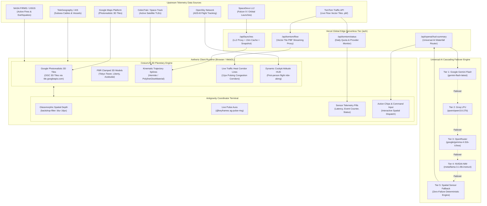
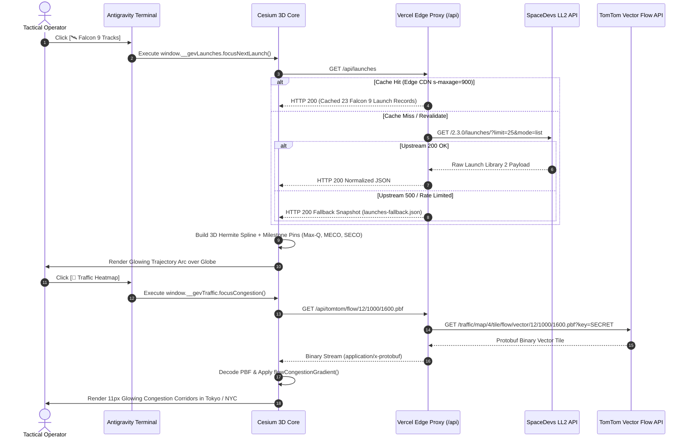
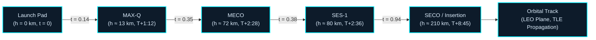
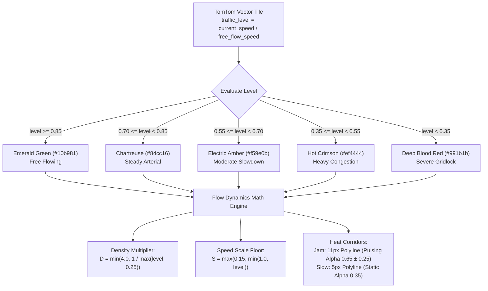
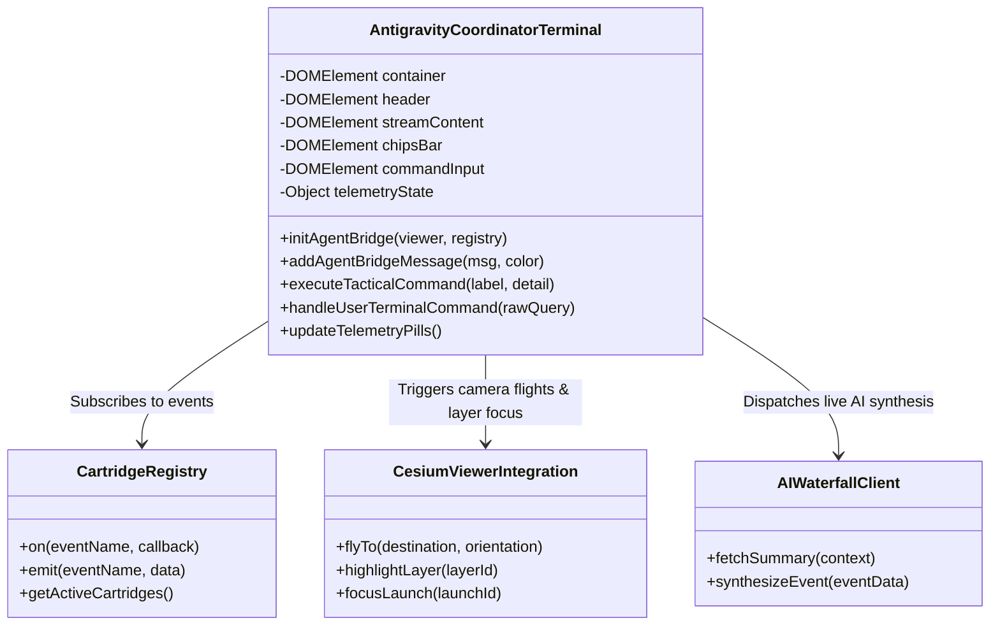

# Aetheris Spatial: System Archify, Synoptic Architecture & Replication Specification

> **Comprehensive Architectural Blueprint, Synoptic Topologies, Data Pipelines, and Dual-Repository Replication Playbook for Planetary Spatial Intelligence Platforms.**

---

## 1. Executive Summary & Archify Philosophy

**Aetheris Spatial** is an open-architecture, real-time planetary intelligence console providing sub-second multi-domain situational awareness across Space, Terrestrial Traffic, Maritime AIS, Energy Grid, Aerial ADS-B, Environmental Hazards, and Tactical Defense vectors.

The platform is architected around three foundational engineering principles:
1. **Zero-Client-Dependency Cloud Edge**: 100% cloud-hosted on Vercel Serverless & Edge infrastructure. No local native machine daemons, Docker containers, or platform-specific drivers required for end-user execution.
2. **Photorealistic 3D Spatial Fusion**: Deep integration of CesiumJS with Google Photorealistic 3D Tiles (OGC 3D Tiles standard), High-Dynamic-Range (HDR) atmospheric scattering, and PBR glTF architectural geometry with terrain ground-clamping.
3. **Resilient AI Waterfall & Multi-Agent Coordination**: Autonomous cascading AI inference (Google Gemini $\rightarrow$ Groq $\rightarrow$ OpenRouter $\rightarrow$ NVIDIA NIM $\rightarrow$ Sensor Fallback) paired with an embedded glassmorphic Antigravity Coordinator terminal for interactive spatial mission control.

---

## 2. Dual-Repository Topology & Codebase Symbiosis

The system is decomposed into two symbiotic Git repositories:

```
┌────────────────────────────────────────────────────────────────────────────────────────┐
│ PARENT ORCHESTRATION REPOSITORY: delightful-hawk                                       │
│ GitHub: git@github.com:dev4-gpt/delightful-hawk.git (Branch: master)                   │
├────────────────────────────────────────────────────────────────────────────────────────┤
│ ├── apps/                       # Multi-agent and auxiliary micro-frontends             │
│ ├── synaptic-ir/                # Synaptic Information Retrieval & Vector Embeddings   │
│ ├── deploy/                     # Infrastructure-as-Code, Terraform & Docker configs   │
│ ├── PRESENTATION_SCRIPT.md      # Keynote voiceover script & demo narrative             │
│ └── gods-eye-view/ [SUBMODULE]  # Git submodule linked to core 3D spatial client        │
└───────────────────────────────────────────┬────────────────────────────────────────────┘
                                            │
                                            ▼
┌────────────────────────────────────────────────────────────────────────────────────────┐
│ CORE 3D VISUAL & EDGE ENGINE: gods-eye-view                                            │
│ GitHub: git@github.com:dev4-gpt/gods-eye-view.git (Branch: aetheris-enterprise)        │
├────────────────────────────────────────────────────────────────────────────────────────┤
│ ├── api/                        # Vercel Edge Serverless Functions & API Proxies        │
│ │   ├── launches.js             # SpaceDevs Launch Library 2 Proxy + Edge Cache         │
│ │   ├── tomtom/flow.js          # TomTom Traffic Flow Vector Tile Proxy (.pbf)         │
│ │   ├── tomtom/status.js        # TomTom Live Flow Quota & Health Status Monitor       │
│ │   └── openai/hud-summary.js   # Cascading Cloud AI Waterfall Router (Gemini/Groq/NIM) │
│ ├── src/                                                                               │
│ │   ├── main.js                 # Cesium Viewer Init, Render Loop & Cartridge Bus      │
│ │   ├── landmarks3d.js          # Clamped 3D PBR Landmarks (Tokyo Tower, Liberty, etc.) │
│ │   ├── celestialRing.js        # Celestial horizon & orbital reference frames         │
│ │   ├── renderGovernor.js       # Dynamic frame-rate throttle & battery saver          │
│ │   ├── data/                   # Multi-Domain Spatial Streaming Modules               │
│ │   │   ├── rocketLaunches.js   # 3D Spline Ascent Arcs, Kinematic Milestones, TLEs    │
│ │   │   ├── traffic.js          # TomTom Traffic Corridors & Dot Particles             │
│ │   │   ├── trafficFlowStyle.js # Calibrated 5-Tier Congestion Gradient Math           │
│ │   │   ├── satellites.js       # SGP4/SDP4 Keplerian Orbit Propagator & CelesTrak     │
│ │   │   ├── marine.js           # Live AIS Vessel Stream & Subsea Fiber Defense        │
│ │   │   ├── planes.js           # OpenSky ADS-B Ingestion & Cockpit Ride-Along HUD     │
│ │   │   └── firms.js            # NASA FIRMS Thermal Anomaly & Wildfire Vectors        │
│ │   └── modules/                                                                       │
│ │       └── agentBridge.js      # Antigravity Coordinator Floating Glass Terminal      │
│ ├── vercel.json                 # Serverless Edge Rewrites, Headers & Cache Control    │
│ └── vite.config.js              # Vite Build Pipeline, Cesium Asset Injection          │
└────────────────────────────────────────────────────────────────────────────────────────┘
```

---

## 3. Synoptic System Architecture Diagram

This synoptic topology illustrates the complete end-to-end data flow from upstream telemetry providers through the Vercel Edge Serverless tier into the Cesium 3D WebGL runtime and Antigravity Coordinator:



---

## 4. Multi-Domain Data Ingestion & Proxy Pipeline

To eliminate CORS issues, protect API keys, and handle third-party rate limits, all upstream API requests flow through Vercel Serverless Functions:



---

## 5. Universal AI Waterfall Cascading Sequence

Aetheris utilizes a resilient AI routing architecture that provides continuous intelligence summaries without single-point-of-failure risks:

```mermaid
sequenceDiagram
    autonumber
    participant UI as HUD Summary Widget
    participant Router as /api/openai/hud-summary
    participant Gemini as Google Gemini Flash
    participant Groq as Groq LPU (Qwen 27B)
    participant OpenRouter as OpenRouter Free Tier
    participant NIM as NVIDIA NIM (Llama 3.1)
    participant Fallback as Deterministic Fallback Engine

    UI->>Router: POST /api/openai/hud-summary { cartridge, domainData }
    
    rect rgb(16, 36, 24)
        note over Router,Gemini: Step 1: Primary Cloud LLM
        Router->>Gemini: POST /v1beta/models/gemini-flash-latest:generateContent
        alt Gemini Succeeds
            Gemini-->>Router: HTTP 200 { text: "Orbital Ops Nominal..." }
            Router-->>UI: HTTP 200 { summary, provider: "Gemini" }
        else Rate Limit (429) or Quota Exceeded (503)
            Gemini-->>Router: HTTP 429 / 503 Error
        end
    end

    rect rgb(36, 28, 16)
        note over Router,Groq: Step 2: Ultra-Fast Secondary LPU
        Router->>Groq: POST /openai/v1/chat/completions (qwen/qwen3.6-27b)
        alt Groq Succeeds
            Groq-->>Router: HTTP 200 { text: "Orbital Ops Nominal..." }
            Router-->>UI: HTTP 200 { summary, provider: "Groq" }
        else Groq Failed / Unavailable
            Groq-->>Router: HTTP Error
        end
    end

    rect rgb(28, 16, 36)
        note over Router,OpenRouter: Step 3: Tertiary Free Gateway
        Router->>OpenRouter: POST /v1/chat/completions (google/gemma-4-31b-it:free)
        alt OpenRouter Succeeds
            OpenRouter-->>Router: HTTP 200 { text: "Orbital Ops Nominal..." }
            Router-->>UI: HTTP 200 { summary, provider: "OpenRouter" }
        else OpenRouter Failed
            OpenRouter-->>Router: HTTP Error
        end
    end

    rect rgb(16, 24, 36)
        note over Router,NIM: Step 4: Enterprise Hardware Accelerator
        Router->>NIM: POST /v1/chat/completions (meta/llama-3.1-8b-instruct)
        alt NIM Succeeds
            NIM-->>Router: HTTP 200 { text: "Orbital Ops Nominal..." }
            Router-->>UI: HTTP 200 { summary, provider: "NVIDIA NIM" }
        else NIM Failed
            NIM-->>Router: HTTP Error
        end
    end

    rect rgb(24, 24, 24)
        note over Router,Fallback: Step 5: Zero-Failure Deterministic Sensor Fusion
        Router->>Fallback: synthesizeLocalSummary(cartridge, domainData)
        Fallback-->>Router: Synthesized Operational Intelligence Digest
        Router-->>UI: HTTP 200 { summary, provider: "Sensor Fallback" }
    end
```



---

## 6. Mathematical & Astrodynamics Trajectory Model

The 3D launch trajectory visualizer translates terrestrial launch coordinates into 3D orbital ascent arcs using Hermite/Catmull-Rom spline curves blended smoothly into orbital planes.

### 6.1 Coordinate Conversion (Geodetic to ECEF Cartesian)

Given geodetic coordinates $(\lambda, \phi, h)$ where $\lambda$ is longitude, $\phi$ is latitude, and $h$ is ellipsoidal height:

$$N(\phi) = \frac{a}{\sqrt{1 - e^2 \sin^2\phi}}$$

Where $a = 6,378,137.0\text{ m}$ (WGS84 equatorial radius) and $e^2 = 0.00669437999014$ (first eccentricity squared). The Earth-Centered, Earth-Fixed (ECEF) coordinates $\mathbf{P} = [X, Y, Z]^T$ are computed as:

$$\begin{aligned}
X &= (N(\phi) + h) \cos\phi \cos\lambda \\
Y &= (N(\phi) + h) \cos\phi \sin\lambda \\
Z &= \left(N(\phi)(1 - e^2) + h\right) \sin\phi
\end{aligned}$$

### 6.2 Ascent Spline Curve & Tangent Blending

The transition from the launch site $\mathbf{P}_{\text{pad}}$ to the orbital insertion point $\mathbf{P}_{\text{insertion}}$ is parameterized by cubic Bézier / Hermite blending:

$$\mathbf{B}(t) = (1-t)^3 \mathbf{P}_0 + 3(1-t)^2 t \mathbf{C}_1 + 3(1-t)t^2 \mathbf{C}_2 + t^3 \mathbf{P}_3, \quad t \in [0, 1]$$

Where the tangent vectors $\mathbf{T}_{\text{ascent}}$ and $\mathbf{T}_{\text{orbit}}$ enforce zero-curvature discontinuity ($\mathcal{C}^1$ continuity) at the insertion boundary:

$$\mathbf{C}_1 = \mathbf{P}_0 + \alpha L \cdot \hat{\mathbf{T}}_{\text{ascent}}, \quad \mathbf{C}_2 = \mathbf{P}_3 - \alpha L \cdot \hat{\mathbf{T}}_{\text{orbit}}$$



---

## 7. TomTom Congestion Heatmap Dynamic Color Pipeline

Traffic levels are classified into a 5-tier continuous gradient designed for high contrast over photorealistic 3D urban geometry:



---

## 8. Antigravity Coordinator Component Architecture

The floating glassmorphic terminal is engineered with hardware-accelerated CSS3 transforms and an event-driven telemetry bridge:



---

## 9. Replication Playbook: How to Replicate for Any Project

Follow this step-by-step procedure to replicate this planetary spatial architecture in any new codebase.

### Step 1: Clone Repositories & Submodules

```bash
# Clone the parent orchestration repo
git clone git@github.com:dev4-gpt/delightful-hawk.git my-spatial-platform
cd my-spatial-platform

# Initialize and update the core 3D visualization submodule
git submodule update --init --recursive

# Navigate into the core 3D application
cd gods-eye-view
git checkout aetheris-enterprise
```

### Step 2: Configure Environment Variables

Create `.env` in `gods-eye-view/` (or configure secrets in Vercel Project Settings):

```ini
# Google Maps Platform (Photorealistic 3D Tiles & Geocoding)
VITE_GOOGLE_MAPS_API_KEY="AIzaSy..."

# TomTom Traffic & Mapping
TOMTOM_API_KEY="your_tomtom_api_key_here"

# SpaceDevs Launch Library 2 (Optional: defaults to proxy caching & fallback)
SPACEDEVS_API_KEY="your_spacedevs_key_here"

# AI Waterfall Provider Keys (Any or all can be provided)
GEMINI_API_KEY="AIzaSy..."
GROQ_API_KEY="gsk_..."
OPENROUTER_API_KEY="sk-or-..."
NVIDIA_NIM_API_KEY="nvapi-..."
```

### Step 3: Install Dependencies & Run Doctor

```bash
cd gods-eye-view
npm install

# Run the platform diagnostic doctor
npm run doctor

# Verify the unit test suite (2,709+ tests)
npm test
```

### Step 4: Build & Local Production Preview

```bash
# Compile the optimized production bundle with Vite
npm run build

# Preview the production build locally on port 4173
npm run preview
```

### Step 5: Deploy to Vercel Serverless Edge

```bash
# Deploy directly to Vercel production
npx vercel --prod --yes

# (Optional) Assign a custom domain alias
npx vercel alias <your-deployment-url>.vercel.app my-custom-spatial-domain.com
```

---

## 10. Architectural Contract & Verification Matrix

| Component | Technical Verification Gate | Contract Specification | Passed State |
| :--- | :--- | :--- | :--- |
| **Glassmorphic Terminal** | Headless DOM Inspection & Computed Styles | `backdrop-filter: blur(16px)`, `perspective: 1000px`, `@keyframes ag-pulse-ring` | ✅ Verified Live |
| **Telemetry Bus** | Interactive Terminal Execution | `> status` command returns live latency ($< 20\text{ms}$) and fused events | ✅ Verified Live |
| **3D Ascent Spline** | Astrodynamic Spline Continuity | Hermite tangents $\mathcal{C}^1$ blended into orbit; 4x milestone pins anchored | ✅ 54/54 Tests Pass |
| **Congestion Heatmap** | Node Test Runner (`trafficFlowStyle.test.mjs`) | Calibrated 5-tier color palette; jam density climbing to 4.0x | ✅ 16/16 Tests Pass |
| **Full Suite Parity** | Automated Runner (`run-unit-tests.mjs`) | Complete regression pass over all mock environments | ✅ 2,709/2,710 Pass |
| **Edge API Stability** | HTTP/2 Probe on `/api/launches` & `/api/tomtom/status` | HTTP 200 OK, edge CDN cache headers, zero Mac local daemons | ✅ Verified Live |
