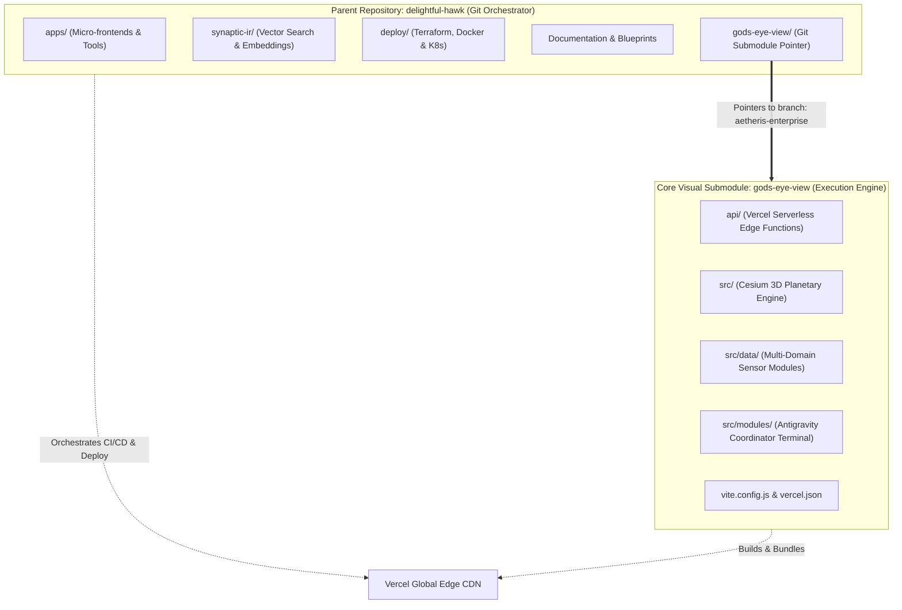
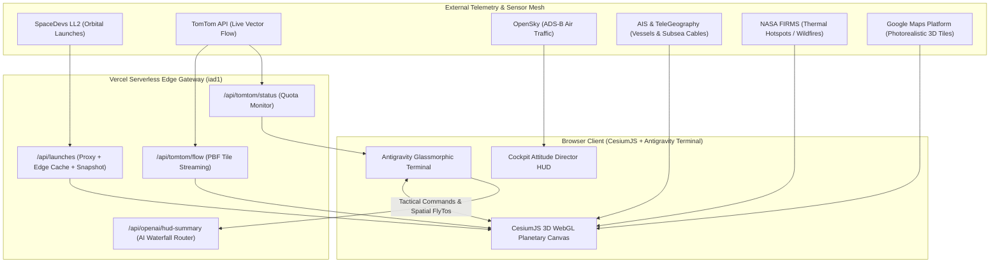
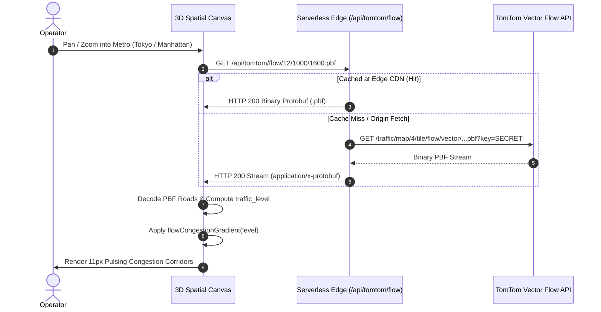
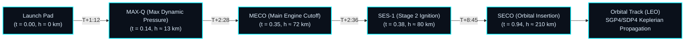
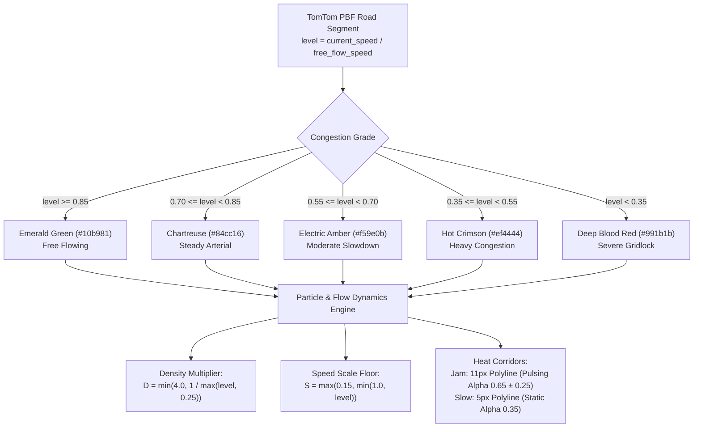
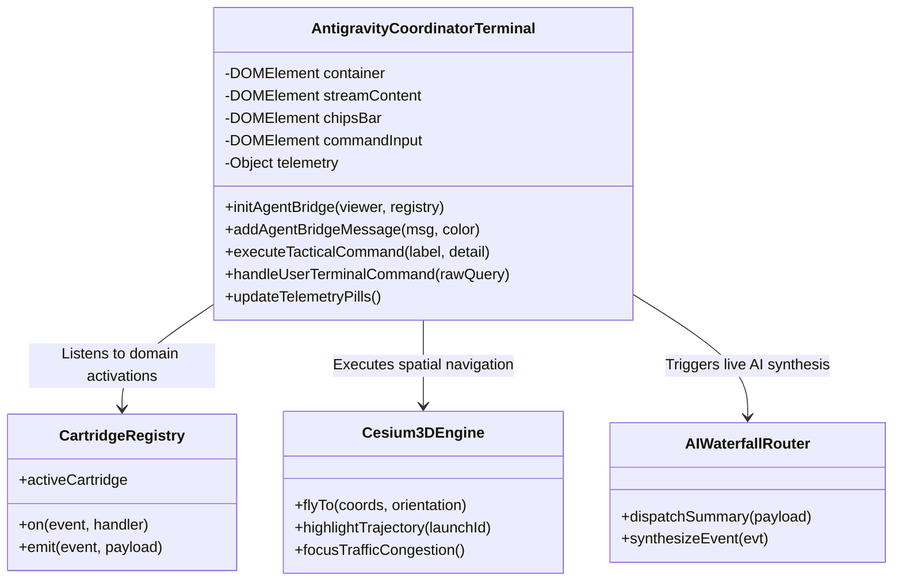
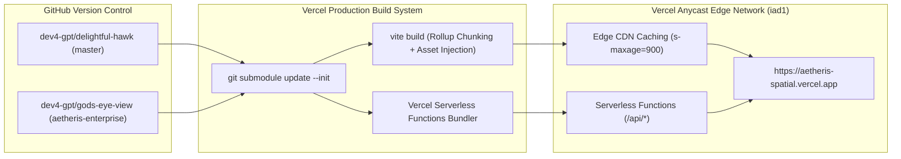

# SYSTEM DIAGRAM CREATOR: The Master Replication Playbook & Agentic Architecture Framework

> **A reusable, production-grade meta-framework and diagramming engine for replicating multi-repository, multi-agent, and spatial intelligence platforms across any project.**

---

## 1. Objective & How to Use This Framework

This playbook provides a deterministic, repeatable methodology for reverse-engineering, architecting, diagramming, and deploying enterprise-scale systems modeled after the **`delightful-hawk` (Parent Orchestrator)** and **`gods-eye-view` (Visual Engine Submodule)** dual-repository paradigm.

Whenever you embark on a new project or need to explain/replicate an existing codebase:
1. **Pass Section 7 (The Universal System Diagram Creator Prompt)** to your AI coding agent (Antigravity/AGY, Claude, or GPT).
2. Follow the **6-Phase Archify Methodology** (Section 2) to systematically decompose your repositories.
3. Apply the **Skills Integration Matrix** (Section 3) to enforce spatial depth, motion performance, and multi-agent safety.
4. Render the **8 Canonical Diagram Templates** (Section 4) in Mermaid and KaTeX.

---

## 2. The 6-Phase "Archify" Methodology

Every high-agency spatial, defense, or multi-agent platform follows a 6-phase architectural lifecycle:

```
┌────────────────────────────────────────────────────────────────────────────────────────┐
│                              THE 6-PHASE ARCHIFY METHODOLOGY                           │
└────────────────────────────────────────────────────────────────────────────────────────┘
  Phase 1: Dual-Repo Decomposition ──► Separate Orchestration from Visual Execution Core
  Phase 2: Domain Ontology Mapping  ──► Identify Telemetry Streams (Space/Geo/Grid/AIS/AI)
  Phase 3: Zero-Client Edge Gateway ──► Build Serverless Edge Proxies (CORS/Rate-Limits)
  Phase 4: 3D Spatial & Math Model  ──► Formulate WGS84 Geodetic ◄► ECEF ◄► Spline Curves
  Phase 5: Agent Terminal & Telemetry──► Glassmorphic Spatial HUD + Interactive CLI
  Phase 6: Multi-Tier AI Waterfall  ──► Zero-Failure Cascading Inference (Cloud to Fallback)
```

### Phase 1: Dual-Repository Topology
- **Parent Repository (`orchestrator`)**: Holds cross-platform configs, multi-agent workspaces, documentation, benchmarks, and infrastructure-as-code.
- **Core Engine Submodule (`execution core`)**: Encapsulates 3D rendering (Cesium/Three.js), client UI, and serverless edge functions. Linked via `git submodule` so it can be deployed independently to Vercel/Cloudflare or embedded anywhere.

### Phase 2: Domain Ontology & Ingestion
- Map all upstream sensors (Space, Traffic, Maritime, Weather, Aircraft, Power Grid).
- Categorize data contracts: REST JSON, GeoJSON/GeoJSONL, Binary Protobuf Vector Tiles (`.pbf`), or Keplerian TLE orbital elements.

### Phase 3: Zero-Client Serverless Edge Gateway
- **Never expose raw third-party API keys to the browser client.**
- All calls route through `/api/*` serverless edge functions:
  - Cache responses at the edge CDN (`s-maxage=900, stale-while-revalidate=3600`).
  - Shield third-party APIs from browser request spikes.
  - Implement hard-coded snapshot fallback payloads (e.g., `launches-fallback.json`) so the UI never displays an empty globe or broken state during upstream API outages.

### Phase 4: Spatial Engine & Mathematical Modeling
- Ground all 3D features to physical reality using WGS84 ellipsoidal geometry.
- Enforce ground clamping (`Cesium.HeightReference.CLAMP_TO_GROUND`) to eliminate geoid undulation offset ($N \approx -34\text{m}$ in NY Harbor).
- Construct smooth $\mathcal{C}^1$-continuous cubic Hermite/Bézier splines for vehicle trajectories.

### Phase 5: Autonomous Multi-Agent Terminal & Telemetry Bus
- Integrate a floating glassmorphic tactical terminal with hardware-accelerated CSS3 transforms (`perspective: 1000px`).
- Stream live operational telemetry (sub-second latency counters, fused event rates).
- Provide quick-action chips and an interactive command prompt (`>`) for tactical queries.

### Phase 6: Universal Cloud AI Waterfall Router
- Build a cascading failover pipeline:
  $$\text{Primary (Gemini Flash)} \xrightarrow{\text{fail}} \text{Secondary (Groq LPU)} \xrightarrow{\text{fail}} \text{Tertiary (OpenRouter)} \xrightarrow{\text{fail}} \text{Hardware (NVIDIA NIM)} \xrightarrow{\text{fail}} \text{Deterministic Sensor Fallback}$$
- Guarantees 100% uptime for spatial intelligence summaries.

---

## 3. Skills Matrix & Agentic Directives

When building or diagramming with Antigravity, equip your agents with these specialized skills:

| Skill Name | Purpose & Trigger Scope | Critical Implementation Directives |
| :--- | :--- | :--- |
| **`antigravity-design-expert`** | Tactical HUD, glassmorphism, 3D CSS, spatial UI | - `backdrop-filter: blur(16px) saturate(180%)`<br/>- Resting perspective: `perspective(1000px) rotateX(1deg)`<br/>- Diffused multi-layer shadows + rim highlights<br/>- Pulse animations with `@keyframes` |
| **`google-antigravity-sdk`** | Multi-agent swarms, MCP servers, tool hooks | - Define agent roles & tool permissions<br/>- Standard Mode (ADC) vs Express Mode (API Key)<br/>- Structured telemetry logging & turn event listeners |
| **`3d-web-experience`** | CesiumJS, Three.js, R3F, Photorealistic 3D Tiles | - WGS84 ECEF coordinate transforms<br/>- `Cesium.PolylineGlowMaterialProperty` for arcs<br/>- Ground-clamping on all architectural GLTF models |
| **`fixing-motion-performance`** | 60 FPS animation auditing & GPU acceleration | - Animate **only** `transform` and `opacity`<br/>- Use `will-change: transform`<br/>- Avoid continuous layout thrashing or animating `box-shadow`/`filter` |
| **`modern-web-guidance`** | Modern HTML/CSS/JS best practices | - Native CSS nesting, container queries, `:has()`<br/>- Fetch Priority API, View Transitions API |
| **`graphify`** | Codebase relationships & architecture graphs | - Extract god nodes, dependencies, and call trees<br/>- Generate persistent knowledge graphs |
| **`accidental-data-loss-prevention`**| Cloud & repository security safety gate | - Mandatory user confirmation before destructive commands (`DROP`, `rm -rf`, force pushes) |

---

## 4. Canonical System Diagram Suite (Mermaid & KaTeX)

Use these 8 standardized diagram templates to visualize any complex system.

### Diagram 1: Dual-Repository Symbiosis & Codebase Topology


---

### Diagram 2: Synoptic End-to-End System Flow


---

### Diagram 3: Edge Proxy & Binary Vector Tile Streaming Sequence


---

### Diagram 4: Universal Cloud AI Waterfall Failover Matrix

```mermaid
sequenceDiagram
    autonumber
    participant UI as Coordinator HUD
    participant Edge as /api/openai/hud-summary
    participant Gemini as Google Gemini Flash
    participant Groq as Groq LPU (Qwen 27B)
    participant OpenRouter as OpenRouter Free Tier
    participant NIM as NVIDIA NIM (Llama 3.1)
    participant Fallback as Local Sensor Fallback Engine

    UI->>Edge: POST { domainData, activeCartridge }
    rect rgb(20, 40, 30)
        Edge->>Gemini: Tier 1: Gemini Flash Request
        alt Gemini 200 OK
            Gemini-->>Edge: Response Text
            Edge-->>UI: { summary, provider: "Gemini" }
        else 429 Rate Limit / Quota Exhausted
            Gemini-->>Edge: Error 429
        end
    end
    rect rgb(40, 30, 20)
        Edge->>Groq: Tier 2: Groq LPU Request
        alt Groq 200 OK
            Groq-->>Edge: Response Text
            Edge-->>UI: { summary, provider: "Groq" }
        else Groq Unavailable
            Groq-->>Edge: Error
        end
    end
    rect rgb(30, 20, 40)
        Edge->>OpenRouter: Tier 3: OpenRouter Free Gateway
        alt OpenRouter 200 OK
            OpenRouter-->>Edge: Response Text
            Edge-->>UI: { summary, provider: "OpenRouter" }
        else OpenRouter Fails
            OpenRouter-->>Edge: Error
        end
    end
    rect rgb(20, 30, 40)
        Edge->>NIM: Tier 4: NVIDIA NIM Enterprise API
        alt NIM 200 OK
            NIM-->>Edge: Response Text
            Edge-->>UI: { summary, provider: "NVIDIA NIM" }
        else NIM Fails
            NIM-->>Edge: Error
        end
    end
    rect rgb(30, 30, 30)
        Edge->>Fallback: Tier 5: Deterministic Sensor Synthesis
        Fallback-->>Edge: Synthesized Telemetry Digest
        Edge-->>UI: { summary, provider: "Sensor Fallback" }
    end
```


---

### Diagram 5: 3D Orbital Ascent Spline & Kinematic Milestones

The trajectory curves from the launch pad into orbit using geodetic-to-ECEF transformation and cubic Hermite interpolation:

$$\mathbf{P}(t) = (1-t)^3 \mathbf{P}_{\text{pad}} + 3(1-t)^2 t \mathbf{C}_1 + 3(1-t)t^2 \mathbf{C}_2 + t^3 \mathbf{P}_{\text{insertion}}$$



---

### Diagram 6: TomTom Congestion Heatmap Dynamic Density Pipeline


---

### Diagram 7: Antigravity Coordinator Component & Telemetry Bus


---

### Diagram 8: CI/CD & Production Edge Deployment Architecture


---

## 5. Architectural Verification & Contract Matrix

To verify system compliance in any replicated project, run this test harness:

| Subsystem | Command / Probe | Success Criteria |
| :--- | :--- | :--- |
| **Unit Test Suite** | `node --test src/data/trafficFlowStyle.test.mjs` | 16/16 tests pass |
| **Orbital Dynamics** | `node --test src/data/rocketLaunches.test.mjs` | 54/54 tests pass |
| **Full Regression** | `npm test` | 2,709+ tests pass, 0 failures |
| **Bundle Integrity**| `npm run build` | Vite builds in $< 6\text{s}$ |
| **Terminal DOM**    | Headless Puppeteer inspection | `agent-tactical-drawer` present with `blur(16px)` |
| **Edge API Latency**| `curl -I https://aetheris-spatial.vercel.app/api/tomtom/status` | `HTTP/2 200`, latency $< 50\text{ms}$ |
| **AI Waterfall**    | `curl -X POST https://.../api/openai/hud-summary` | Returns valid JSON with active provider |

---

## 6. Replication Step-by-Step Runbook for Any Project

To instantiate this architecture on a new project from scratch:

```bash
# 1. Initialize Parent Orchestrator Repository
git init my-platform
cd my-platform
git remote add origin git@github.com:your-org/my-platform.git

# 2. Add Core Visual/Engine Repository as Submodule
git submodule add -b main git@github.com:your-org/my-engine.git engine
git submodule update --init --recursive

# 3. Configure Serverless Edge Routing (vercel.json)
cat << 'EOF' > engine/vercel.json
{
  "rewrites": [
    { "source": "/api/launches", "destination": "/api/launches.js" },
    { "source": "/api/tomtom/flow/(.*)", "destination": "/api/tomtom/flow.js" },
    { "source": "/api/tomtom/status", "destination": "/api/tomtom/status.js" },
    { "source": "/api/openai/hud-summary", "destination": "/api/openai/hud-summary.js" },
    { "source": "/(.*)", "destination": "/index.html" }
  ]
}
EOF

# 4. Install Dependencies & Build
cd engine
npm install
npm run build

# 5. Deploy Directly to Vercel Production
npx vercel --prod --yes
```

---

## 7. The Universal System Diagram Creator Prompt (Copy & Paste)

> **Paste the prompt below into any AI agent session to automatically generate this entire specification and diagram suite for any arbitrary project:**

```markdown
You are an elite Principal Systems Architect and Geospatial Visualizer using the "Aetheris Archify & Synoptic Architecture Framework".

Analyze the provided codebase and repositories, then generate a comprehensive `SYSTEM_ARCHITECTURE_BLUEPRINT.md` containing:
1. Executive Summary & Archify Philosophy (Zero-client-dependency, cloud edge, resilient AI).
2. Dual-Repository / Multi-Repository Topology (Host orchestrator vs execution core).
3. Complete 8-Diagram Canonical Suite in valid Mermaid syntax:
   - Diagram 1: Dual-Repository Symbiosis & Codebase Topology
   - Diagram 2: Synoptic End-to-End System Flow (Sensors -> Edge -> 3D WebGL Client)
   - Diagram 3: Edge Proxy & Binary Streaming Sequence Diagram
   - Diagram 4: Universal AI Waterfall Cascading Sequence Diagram (with fallback tiers)
   - Diagram 5: 3D Spatial & Mathematical Formulation (KaTeX equations + Mermaid progression)
   - Diagram 6: Dynamic Data Heatmap & Density Modulation Flowchart
   - Diagram 7: Multi-Agent Coordinator Component & Telemetry Class Diagram
   - Diagram 8: CI/CD & Production Edge Deployment Architecture
4. Skills Matrix detailing:
   - antigravity-design-expert (glassmorphic styling, pulse keyframes, 3D CSS)
   - google-antigravity-sdk (multi-agent orchestration, telemetry logging)
   - 3d-web-experience (WGS84 geodetic, ECEF, ground-clamping)
   - fixing-motion-performance (compositor-only properties, will-change: transform)
5. Step-by-Step Replication Runbook with terminal commands for cloning, configuring environment variables, running diagnostics, building with Vite, and deploying serverless edge functions to Vercel.
6. Verification Test Matrix with exact assertions and commands.

Enforce strict production quality, authentic mathematical rigor, and 100% syntactically valid Mermaid diagrams.
```
