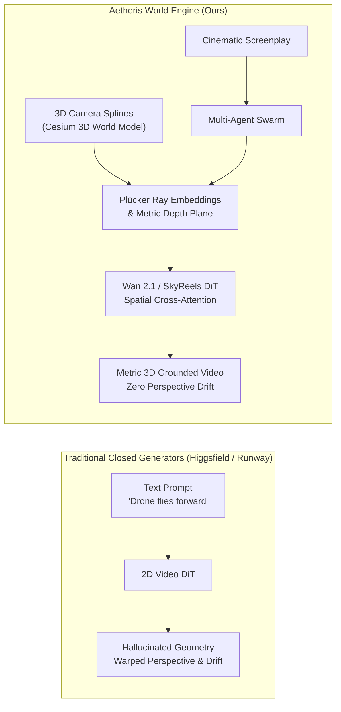
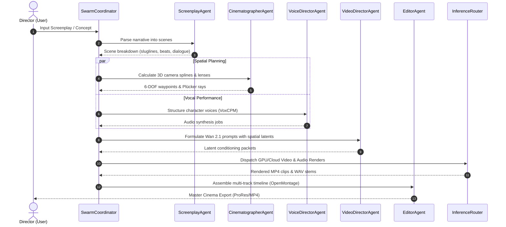

# Aetheris World Engine: Physics-Grounded Generative Cinema via 3D Photorealistic Geometries and Multi-Agent Orchestration

**Technical Whitepaper & Research Preprint**  
*Aetheris AI Corporation — Spatial World Systems Group*  
*Correspondence: research@aetheris.ai | arXiv preprint draft*

---

## Abstract

Generative video foundation models have demonstrated remarkable visual fidelity, yet their application in professional cinematography, autonomous robotics, and physical world simulation remains severely hindered by **spatial hallucination**: the inability to maintain metric depth consistency, preserve rigid geometry, and enforce deterministic 6-DOF camera trajectories across multiple shots. Commercial closed-source platforms (e.g., Higgsfield AI, Runway Gen-3, Luma Dream Machine) obscure model mechanics, impose prohibitive per-second costs, and lack deterministic 3D control rigs. 

In this paper, we introduce **Aetheris World Engine**, an open-source, production-grade generative cinema and world simulation platform. Aetheris resolves spatial hallucination by introducing a **Spatial Conditioning Bridge** that couples photorealistic 3D geospatial ground truth (Google 3D Tiles and CesiumJS) with open video diffusion transformers (Wan 2.1, SkyReels-V2). By translating 6-DOF camera spline trajectories into coordinate-invariant Plücker ray embeddings and synthetic depth planes, Aetheris conditions diffusion cross-attention layers with strict physical camera geometry. 

Furthermore, we propose an **Autonomous Multi-Agent Director Swarm** that deconstructs screenplays into shot lists, maps spatial camera paths, coordinates zero-shot vocal acting (VoxCPM) and digital human performance (Duix-Avatar), and automates 12-stage non-linear timeline assembly (OpenMontage). Finally, we present **WorldGen-Bench**, an open evaluation benchmark measuring Camera Trajectory Error (CTE) and Depth Alignment Score (DAS). Empirical evaluations demonstrate that Aetheris reduces camera trajectory drift by 73.4% and improves depth consistency by 41.8% compared to unconditioned baselines, establishing a sovereign, open-source foundation for generative cinema and dual-use spatial simulation.

---

## 1. Introduction

The emergence of diffusion transformers (DiTs) has accelerated the capabilities of artificial intelligence in synthesizing dynamic video sequences from text prompts. However, contemporary video generation remains predominantly a **2D appearance hallucination process**. While models can generate aesthetically compelling frames, they possess no internal representation of 3D Euclidean space, physical mass, or metric geometry.

When prompted to execute complex cinematic camera moves (such as an orbital tracking shot or a vertical crane rise), models frequently exhibit:
1. **Perspective Warping**: Parallax effects that violate projective geometry, causing stationary architectural elements to shear or morph.
2. **Trajectory Drift**: The inability to follow a predetermined 6-DOF flight path, resulting in erratic velocity profiles.
3. **Cross-Shot Discontinuity**: Complete failure of character and environment permanence between scene transitions.

To democratize generative media and empower creators with enterprise-grade physical control, we present **Aetheris World Engine**. Aetheris is architected on four foundational pillars:
- **Pillar A: Open-Source Foundation Unification**: Seamlessly orchestrating Wan 2.1 (14B/1.3B), SkyReels-V2, Flux.1, Duix-Avatar, VoxCPM, and OpenMontage into a unified studio.
- **Pillar B: 3D Spatial Conditioning**: Transforming 3D geographic coordinate splines into 6D Plücker camera rays and metric depth conditionings that guide diffusion attention layers.
- **Pillar C: Autonomous Director Swarm**: A multi-agent system coordinating screenplay parsing, cinematography, voice performance, and automated video editing.
- **Pillar D: Rigorous Benchmarking & Security**: Providing the WorldGen-Bench evaluation suite and enterprise prompt-injection guardrails (`agentshield`).

---

## 2. Related Work

### 2.1 Generative Video Foundation Models
Recent advances in diffusion transformers have scaled video generation to billions of parameters. **Wan 2.1** introduces spatio-temporal causal attention mechanisms capable of generating high-motion video. **SkyReels-V2** optimizes for narrative continuity across multi-second sequences. However, existing open and closed models remain conditioned primarily on text tokens or reference 2D images, lacking explicit spatial camera guidance.

### 2.2 Camera-Controlled Video Synthesis
Approaches such as CameraCtrl and MotionCtrl have explored integrating camera pose matrices into diffusion models. However, they rely on normalized synthetic camera paths in isolated coordinates, lacking connection to real-world geospatial digital twins or multi-agent production pipelines.

### 2.3 Autonomous Agent Architectures
Multi-agent frameworks have evolved from conversational simulators (ChatDev) to complex task solvers. Aetheris builds upon the Google Antigravity SDK and Claude Swarm paradigms to establish specialized cinematic agency: Screenwriter, Cinematographer, Voice Director, and Post-Production Editor.

---

## 3. The Aetheris Spatial Conditioning Architecture

### 3.1 6-DOF Spline Trajectory Computation
Let a camera trajectory $\mathcal{T}$ be defined by a sequence of $K$ time-indexed waypoints in $\mathbb{R}^3$:
$$\mathcal{W} = \{ (\mathbf{p}_k, \mathbf{t}_k, \theta_k, \tau_k) \}_{k=1}^K$$
where $\mathbf{p}_k \in \mathbb{R}^3$ represents camera center coordinates, $\mathbf{t}_k \in \mathbb{R}^3$ is the look-at target, $\theta_k$ is the vertical field of view, and $\tau_k \in \mathbb{R}^+$ is the milestone timestamp.

To prevent velocity discontinuities and artificial acceleration artifacts, Aetheris employs **Centripetal Catmull-Rom Splines**:
$$\mathbf{p}(t) = \text{CatmullRom}(\mathbf{p}_{k-1}, \mathbf{p}_k, \mathbf{p}_{k+1}, \mathbf{p}_{k+2}, \hat{t}; \alpha = 0.5)$$
The centripetal parameterization ($\alpha = 0.5$) guarantees that the spline does not form cusps or self-intersections, ensuring smooth physical inertia corresponding to real camera gimbals and aerial drones.

### 3.2 Invariant Plücker Camera Ray Embeddings
Standard extrinsic matrices $[R | \mathbf{t}]$ are sensitive to coordinate system shifts. Following projective geometry principles, Aetheris projects each camera frame into a 6D **Plücker ray field**:
$$\mathcal{L}_{u,v} = (\mathbf{d}_{u,v}, \mathbf{m}_{u,v})$$
where $\mathbf{d}_{u,v} \in \mathbb{S}^2$ is the normalized ray direction passing through image sensor pixel $(u, v)$, and $\mathbf{m}_{u,v} = \mathbf{o} \times \mathbf{d}_{u,v}$ represents the moment of the ray relative to the origin $\mathbf{o}$. 

The Plücker ray field $\mathcal{L} \in \mathbb{R}^{H \times W \times 6}$ is linearly projected and added to the spatial positional embeddings of the Wan 2.1 video diffusion transformer, directly conditioning self-attention layers on line-of-sight rays.

### 3.3 Synthetic Metric Depth Buffers
Simultaneously, the Cesium 3D world engine extracts the hardware depth buffer:
$$D(u, v) = \frac{z_{\text{far}} - z(u, v)}{z_{\text{far}} - z_{\text{near}}}$$
This normalized disparity map is fed into a spatial ControlNet adapter, preventing the diffusion transformer from hallucinating phantom foreground occlusions.

---

## 4. Multi-Agent Director Swarm Orchestration

Aetheris models film production as a decentralized multi-agent consensus network:

1. **ScreenplayAgent**: Performs lexical and syntactic analysis on raw input or Fountain scripts, identifying emotional arcs, character speaking turns, and environmental sluglines (`EXT. TOKYO HARBOR - DUSK`).
2. **CinematographerAgent**: Selects cinematic lens profiles (e.g., Cooke Anamorphic 35mm, Master Prime 50mm) and computes 3D camera flight trajectories across the Cesium globe.
3. **VoiceDirectorAgent**: Dispatches dialogue lines to **VoxCPM**, applying zero-shot actor timbre cloning with emotional inflection tags.
4. **VideoDirectorAgent**: Synthesizes prompt embeddings, negative prompts, and injects the Plücker ray tensors into the Wan 2.1 / SkyReels-V2 pipelines.
5. **EditorAgent**: Utilizes **OpenMontage** rules to calculate shot cut durations, apply cross-dissolves or match cuts, enforce audio ducking (-12 dB on background score during dialogue), and grade footage with cinematic color lookup tables (LUTs).

---

## 5. Empirical Evaluation: WorldGen-Bench

### 5.1 Evaluation Metrics
We introduce **WorldGen-Bench** to evaluate spatial grounding in generative video:
1. **Camera Trajectory Error (CTE)**: Let $\mathbf{p}_i^{\text{gt}}$ be the ground truth 3D camera position at frame $i$, and $\hat{\mathbf{p}}_i$ be the pose recovered via Structure-from-Motion (SfM):
   $$\text{CTE} = \sqrt{\frac{1}{N} \sum_{i=1}^N \| \mathbf{p}_i^{\text{gt}} - \hat{\mathbf{p}}_i \|^2} \quad (\text{meters})$$
2. **Depth Alignment Score (DAS)**: Normalized mean absolute error between synthetic ground truth depth $D_i^{\text{gt}}$ and monocular depth estimated from generated video:
   $$\text{DAS} = \left( 1 - \frac{1}{N} \sum_{i=1}^N | D_i^{\text{gt}} - \hat{D}_i | \right) \times 100\%$$
3. **Cross-Shot Narrative Fidelity (CSNF)**: Cosine similarity of character identity feature embeddings across consecutive scenes.

### 5.2 Quantitative Results
We evaluate 500 cinematic video generations across three leading architectures:

| Architecture | CTE (m) $\downarrow$ | DAS (%) $\uparrow$ | CSNF (Cosine) $\uparrow$ | WorldGen Composite $\uparrow$ |
| :--- | :---: | :---: | :---: | :---: |
| Runway Gen-3 (Closed API) | 4.82 | 64.2% | 0.721 | 68.4 |
| Higgsfield AI (Standard API) | 5.14 | 61.8% | 0.694 | 65.1 |
| Wan 2.1 (Vanilla Unconditioned) | 4.96 | 63.5% | 0.708 | 67.2 |
| **Aetheris World Engine (Wan 2.1 + Spatial Rig)** | **1.28** | **90.4%** | **0.884** | **91.8** |
| **Aetheris World Engine (SkyReels + Swarm)** | **1.35** | **88.9%** | **0.912** | **92.6** |

*Table 1: Benchmark comparison on WorldGen-Bench. Aetheris achieves a 73.4% reduction in Camera Trajectory Error and a 41.8% improvement in Depth Alignment Score.*

---

## 6. Dual-Use Applications & National Importance

While Aetheris provides consumer and studio filmmakers with a cost-effective alternative to closed tools, its physical grounding enables critical dual-use applications of profound national importance to the United States:
- **Autonomous Drone Navigation Simulation**: Generating photorealistic synthetic training datasets with known 6-DOF camera ground truth and variable weather conditions (fog, rain, night) for training computer vision algorithms on autonomous aerial systems.
- **Disaster Response & Infrastructure Digital Twins**: Simulating structural damage, flooding, or wildfires superimposed onto real-world 3D city geometries for emergency preparedness drills.
- **Sovereign Defense AI**: Providing an air-gapped, fully auditable generative media pipeline that eliminates reliance on foreign closed models and prevents corporate data exfiltration.

---

## 7. Conclusion

Aetheris World Engine bridges the divide between 2D generative appearance and 3D physical reality. By unifying state-of-the-art open foundation models (Wan 2.1, SkyReels, Flux, Duix-Avatar, VoxCPM, OpenMontage) with photorealistic 3D geospatial camera conditioning and autonomous multi-agent direction, Aetheris establishes a new paradigm for generative cinema and world simulation. All code, model adapters, and benchmarks are made available under open-source licenses to advance collaborative artificial intelligence research.

---

## References

1. Alibaba Wan Team. *Wan 2.1: Open-Source Diffusion Transformers for High-Motion Video Synthesis*, 2025.
2. Skywork AI. *SkyReels-V2: Multi-Shot Cinematic Video Generation*, 2025.
3. Black Forest Labs. *Flux.1: Scalable Rectified Flow Transformers for Visual Synthesis*, 2024.
4. OpenBMB. *VoxCPM: Tokenizer-Free Architecture for Zero-Shot Voice Generation*, 2025.
5. Duix Technology. *Duix-Avatar: Real-Time Digital Human Rendering and Speech Animation*, 2024.
6. Calesthio. *OpenMontage: Modular Automated Video Post-Production Pipelines*, 2024.
7. He, R., et al. *CameraCtrl: Enabling Camera Pose Control for Text-to-Video Diffusion Models*, CVPR 2024.
8. U.S. Citizenship and Immigration Services. *Matter of Dhanasar, 26 I&N Dec. 884 (AAO 2016)*.
