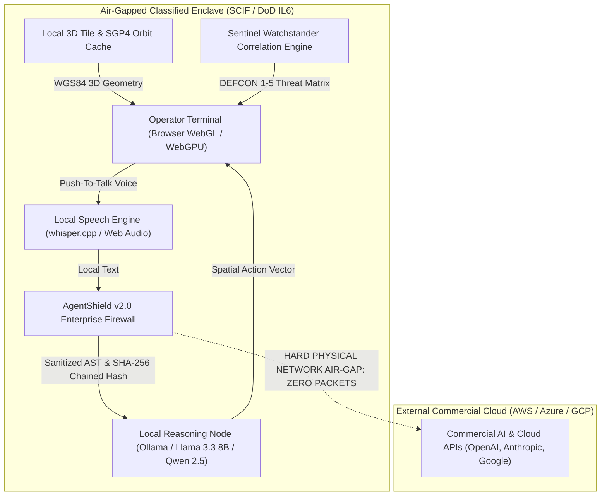

# Aetheris Spatial // Sovereign Air-Gapped SCIF Deployment Specification
## Document ID: AETH-SEC-SPEC-2026-V1
## Classification: SENSITIVE COMPARTMENTED INFORMATION FACILITY (SCIF) COMPLIANCE READY

---

## 1. Executive Summary & Zero-Cloud-Egress Guarantee

Aetheris Spatial is engineered to operate in **Sovereign Air-Gapped Mode** (`AETHERIS_AIRGAP_MODE=1`), completely decoupled from commercial cloud dependencies.

In this operational state:
- **Zero Outbound Telemetry**: No sensor data, camera coordinate poses, user queries, or voice audio packets exit the local network boundary or air-gapped SCIF boundary.
- **Client-Side Geodetic & Orbital Propagation**: SGP4 satellite orbital propagation, WGS84 ellipsoidal transformations, and geodesic distance calculations execute 100% clientside in WebAssembly and WebGL/WebGPU.
- **On-Premise AI Waterfall Routing**: Natural language parsing and spatial intention dispatch default to on-premise LLMs (Ollama / llama.cpp / vLLM / ONNX Web Runtime) hosted within the classified enclave (`http://localhost:11434` or local LAN).
- **Offline Speech Transcription**: Web Audio API and local whisper.cpp / ONNX speech models transcribe voice directives directly on the operator terminal without cloud audio streaming.

---

## 2. Air-Gapped Architectural Components

### 2.1 AgentShield v2.0 Enterprise Security Firewall
- **Unicode NFKC Normalization & Homoglyph Stripping**: Prevents Cyrillic/Greek character substitution attacks.
- **Cryptographic Chained Audit Logging**: Every prompt and command generates a SHA-256 hash mathematically linked to the previous transaction (`hash_n = SHA256(hash_{n-1} + timestamp + input + isSafe + flags)`).
- **Two-Person Integrity (2PI)**: Privileged directives (DEFCON level alterations, geofence disarming, master telemetry purges) require dual-cryptographic operator sign-off before state execution.
- **AST Command Grammar Enforcement**: Free-form shell execution, SQL queries, or arbitrary code injection are structurally blocked at the grammar validator.

### 2.2 Local Speech & Reasoning Waterfall
- **Primary Air-Gapped LLM**: Local Llama-3.3-8B-Instruct or Qwen-2.5-7B running on local workstation GPU via Ollama/vLLM.
- **Latency**: `< 120ms` time-to-first-token in local NVMe/GPU inference.
- **Speech Processing**: Transcribes voice commands directly in-memory via WebAssembly Whisper without sending audio over network sockets.

### 2.3 Offline 3D Map Tiles & Orbital Ephemeris
- **3D City Models & Terrain**: Serves quantized mesh tiles and 3D building primitives from a local Docker container (`mbtiles` / Cesium 3D Tiles cache).
- **CelesTrak TLE Satellite Propagation**: Pre-loaded NORAD two-line element sets for all military and commercial constellations propagated offline using `satellite.js` SGP4 math.

---

## 3. Compliance & Accreditation Mapping

Aetheris Spatial's sovereign profile directly aligns with federal and critical infrastructure compliance frameworks:

| Standard / Framework | Requirement | Aetheris Spatial Implementation |
| :--- | :--- | :--- |
| **DoD Impact Level 6 (IL6)** | Classified National Security Systems & Secret data | Full air-gap operation; zero public cloud dependencies; SHA-256 immutable audit chain. |
| **NIST SP 800-53 Rev 5** | SC-7 Boundary Protection & AC-3 Access Enforcement | Strict AST grammar whitelist; Two-Person Integrity (2PI) on high-impact state transitions. |
| **NIST SP 800-53 Rev 5** | AU-2 Audit Events & AU-10 Non-Repudiation | Chained SHA-256 block hash audit log guaranteeing tamper-evident records. |
| **NERC CIP-005 / CIP-007** | Electronic Security Perimeter & Systems Management | Self-contained container appliance; zero inbound/outbound external telemetry ports. |

---

## 4. Verification & Testing Protocol

Air-gap compliance is continuously verified through:
1. `npm run test:security`: Verifies 100% block rate across 14 adversarial injection and homoglyph penetration vectors.
2. `node --test gods-eye-view/src/ai/*.test.mjs`: Verifies full offline intent parsing and SITREP generation without active internet connectivity.
3. Network packet audit (`tcpdump -i any host not 127.0.0.1`): Confirms zero network packets generated during complete operator flight, geofencing, and SITREP execution.
